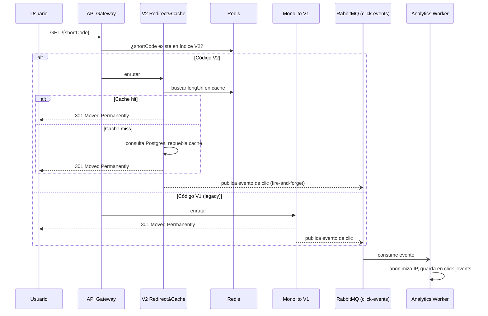

# Technical Architecture Documentation: Enterprise URL Shortener

## Executive Summary

This document is the result of a requirements analysis, task decomposition, and architecture engineering process carried out by Art (engineer) with assistance from Claude, for a URL shortener prototype to be built in 2–3 days. The goal of the exercise is not only to deliver a functional shortener, but to demonstrate: requirements understanding, task decomposition, AI-accelerated execution with traceability and engineer ownership, and conscious management of risks and trade-offs under a constrained timeframe.

This document covers the decisions already made, makes explicit those deliberately simplified due to time constraints, and defines a day-by-day execution plan with cut lines so that the scope remains defensible to any technical reviewer.

---

## 1. Requirement Understanding

**Original requirement (exercise brief):** build a URL shortener from scratch with core APIs, analytics, and "reliability features," demonstrating AI-accelerated engineering execution in 2–3 days, covering three scenarios (greenfield, brownfield, ambiguous).

**Identified ambiguities and how they were normalized:**

- The brief does not specify the stack, persistence, or level of auth/analytics → resolved through direct conversation with the stakeholder (see decisions in Section 2).
- "Reliability features" is vague → normalized to: read caching for the critical redirect path, asynchronous decoupling of analytics, versioned and auditable schema migrations, and explicit failure handling (Redis down, broker down, hash collision).
- The "brownfield" scenario cannot be literal because there is no pre-existing codebase (a purely greenfield project) → it was decided to **simulate** brownfield conditions: build a minimal V1 on Day 1 and treat it as a legacy system starting on Day 2, in order to demonstrate reasoning about evolving existing code, impact analysis, and zero regression. This is stated explicitly here so it is not read as a real pre-existing legacy system.
- The expected level of "production" readiness is not defined → interpreted as: production-quality code (modular, tested, secure) without the need to deploy to paid real-world cloud infrastructure, given the 2–3 day timebox (see Section 9, GKE Roadmap).

## 2. Assumptions

- Target prototype scale: hundreds of creations/day and thousands of redirects/day (enough to demonstrate the caching and async patterns, not real production traffic).
- Single-region, with no real multi-zone high-availability requirements (the path is documented, not implemented).
- There are no formal regulatory compliance requirements (GDPR/CCPA); IP anonymization is adopted as a best practice, not in response to a specific legal obligation.
- "V1" and "V2" links coexist under the same root domain; the short code must be indistinguishable in form to the end user (neither `/api/v1/` nor `/api/v2/` is exposed in the shared link).
- Access to GitHub Codespaces (or equivalent local Docker) is assumed as the execution environment; access to a GCP account with active billing is not assumed for this exercise.

---

## 3. Architecture Overview

### 3.1 Components

- **API Gateway (Spring Cloud Gateway):** single entry point. Applies the **Strangler Fig** pattern:
    - `/api/v1/...` (management control plane) → Monolito Legacy (V1).
    - `/api/v2/...` (management control plane) → Microservicios modernos (V2).
    - `GET /{shortCode}` (data plane, the actual redirect) → el Gateway **no** decide por prefijo de URL (the public link must never contain `/api/`), sino by querying a shared code registry: first checking whether the code exists in the V2 index (Redis), and if not, delegating to the V1 Monolith. This is what makes Strangler Fig genuinely work for a shortener: the public domain remains a single stable domain even as the backend behind it changes over time.
- **Legacy Monolith (V1):** Java/Spring Boot. Original shortening and basic redirect system, deliberately simple (ver sección 1). PostgreSQL con Liquibase para control de esquema.
- **Microservicios (V2):**
    - **Shortener Service:** URL creation (custom alias, expiration, conditional redirect rules), protected with OAuth2/OIDC.
    - **Redirect & Cache Service:** high-speed reads; cache-aside with Redis, falling back to PostgreSQL on cache miss or if Redis does not respond.
    - **Analytics Worker:** asynchronous RabbitMQ consumer (`click-events` queue) that processes V1 and V2 clicks without blocking the redirect.
    - **Bulk Processor:** asynchronous RabbitMQ consumer (`bulk-url-jobs` queue, separate from `click-events` to avoid mixing traffic) that processes bulk URL creation.
- **Identity Provider (Keycloak):** issues and validates OIDC tokens. V2 services act as OAuth2 Resource Servers (they do not implement their own Authorization Server). It starts with a versioned `realm-export.json` in the repo to avoid manual configuration.

### 3.2 Technology Stack

| Category | Choice |
|---|---|
| Language | Java 17 / Spring Boot 3.x |
| Persistence | PostgreSQL (source of truth) |
| Cache | Redis (redirect cache-aside + rate limiting; **not** for click counters) |
| Identity Provider | Keycloak (OIDC), services as Resource Servers |
| Messaging | RabbitMQ (separate queues: `click-events`, `bulk-url-jobs`) |
| Migrations | Liquibase |
| Testing | JUnit 5, MockMvc, Testcontainers |
| Execution environment | GitHub Codespaces (Docker-in-Docker) + local kind/k3d cluster |

### 3.3 Control Flow (Redirect)



### 3.4 Key Decisions

- **Strangler Fig, declarado explícitamente como simulación didáctica de brownfield** (ver sección 1) — permite demostrar modernización incremental sin fingir que existe un sistema heredado real.
- **Desacoplamiento de analíticas vía RabbitMQ:** evita que el conteo de clics penalice la latencia de redirección. Riesgo aceptado y documentado: pérdida silenciosa de un evento si el broker está caído en el instante de publicación (ver sección 8, Riesgos).
- **Redis solo para lectura y rate limiting, nunca como fuente de verdad de contadores:** evita inconsistencia si Redis se reinicia; los contadores reales se derivan de la tabla `click_events` en Postgres.
- **Keycloak como Identity Provider en vez de un Authorization Server propio:** reduce drásticamente el esfuerzo de implementar OAuth2/OIDC "real" dentro del timebox.
- **Liquibase sobre DDL nativo:** cambios de esquema auditables y reversibles, crítico para el escenario brownfield.

---

## 4. API & Data Model

### 4.1 Main Endpoints

**V1 (legacy, no auth):**
- `POST /api/v1/urls` `{ longUrl }` → `{ shortCode, shortUrl }`
- `GET /{shortCode}` → `301` (redirección pública)

**V2 (modern):**
- `POST /api/v2/urls` *(auth requerido)* `{ longUrl, customAlias?, expiresAt?, redirectRules? }` → `{ shortCode, shortUrl, ownerId }`
- `GET /{shortCode}` → `301`/`302`, o `410 Gone` si expiró (redirección pública, sin auth)
- `POST /api/v2/urls/bulk` *(auth requerido)* `{ urls: [{ longUrl, customAlias? }, ...] }` → `{ jobId, status: "PENDING", totalItems }`
- `GET /api/v2/urls/bulk/{jobId}` *(auth requerido)* → `{ status, totalItems, processedItems, failedItems, items: [...] }`
- `GET /api/v2/urls` *(auth requerido)* → lista de links del usuario autenticado
- `DELETE /api/v2/urls/{shortCode}` *(auth requerido, solo dueño)* → revocación
- `GET /api/v2/urls/{shortCode}/analytics` *(auth requerido, solo dueño)* → métricas agregadas desde `click_events`

### 4.2 Data Model (Summary)

- `urls` (V1): `id, short_code (unique), long_url, created_at, expires_at (nullable, agregado vía Liquibase en el escenario brownfield)`
- `short_links` (V2): `id, short_code (unique), long_url, owner_user_id (FK, nullable si se permite anónimo), redirect_rules (jsonb), created_at, expires_at, is_active`
- `app_user` (V2): `id, keycloak_subject (unique), email, created_at` — no se almacenan passwords localmente, Keycloak es la fuente de identidad
- `click_events` (append-only, alimentada por V1 y V2): `id, short_code, service_origin, occurred_at, anonymized_ip, user_agent, device_type, referrer`
- `bulk_jobs`: `id, owner_user_id, status, total_items, processed_items, failed_items, created_at, completed_at`
- `bulk_job_items`: `id, bulk_job_id (FK), line_index, long_url, status, short_code (nullable), error_message (nullable)`

---

## 5. Security

- **AuthN/AuthZ:** OIDC via Keycloak. Creation, bulk, listing, and analytics endpoints require a valid Bearer JWT; `GET /{shortCode}` (the redirect) remains public by design.
- **Open redirect / phishing abuse prevention:** every `longUrl` is validated against: allowed scheme (`http`/`https` only), rejection of internal/private hosts (RFC 1918, `localhost`, cloud metadata endpoints) to prevent SSRF, with verification against a phishing/malware list (e.g. Google Safe Browsing API) documented as a future improvement if time is insufficient to implement it.
- **Rate limiting:** on `POST /api/v2/urls` and `/bulk`, using Redis (sliding window or token bucket) to mitigate unauthorized bulk creation abuse.
- **Secret Management:**
    - En Codespaces: credenciales de Postgres/RabbitMQ/Keycloak se inyectan como *Codespaces secrets* (repo/usuario), nunca se commitean.
    - En Kubernetes: como `Secret` de K8s (con la salvedad documentada de que es solo base64, no cifrado en reposo — mejora futura: SOPS o sealed-secrets).
    - Si se avanza hacia GCP real: Workload Identity Federation en vez de llaves JSON de service account.
- **Reserved slugs:** codes such as `api`, `admin`, `health`, `actuator` are kept on an exclusion list so they are never assigned as custom aliases.

---

## 6. Three Scenarios

### Scenario A — Greenfield: High-Speed Redirect & Cache Service

**Decomposition:**
1. Contrato REST V2 para creación y resolución de URLs.
2. Integración con Spring Data Redis (cache-aside).
3. Generador de hash Base62 con manejo de colisiones (reintento + fallback a mayor longitud).
4. Pruebas unitarias e integración con Testcontainers.

**AI-Assisted Execution (Traceability):**
- Prompt inicial: *"Actúa como experto en Spring Boot. Genera un servicio de redirección que consulte Redis y haga fallback a PostgreSQL si el caché expira."*
- Intervención humana: la IA no manejó el caso de Redis caído (no solo cache-miss, sino conexión rechazada). Se rechazó la propuesta inicial y se añadió un Circuit Breaker (Resilience4j) para que una caída de Redis no tumbe el redirect, degradando a consulta directa a Postgres.

**Validation:** prueba de carga local simulando concurrencia, verificando que el fallback a Postgres no genera errores 5xx cuando Redis está caído (chaos test manual: apagar el contenedor de Redis a mitad de la prueba).

### Scenario B — Brownfield: Evolution of the V1 Monolith

**Decomposition:**
1. Análisis de impacto del esquema actual de V1.
2. Changelog de Liquibase (`changelog-v1.2.xml`) agregando `expires_at` sin romper filas existentes.
3. Characterization tests (JUnit + MockMvc) para congelar el comportamiento actual de V1 antes de tocarlo.
4. Refactor quirúrgico para que V1 también publique eventos de clic a RabbitMQ.

**AI-Assisted Execution (Traceability):**
- Prompt inicial: *"Genera un script de Liquibase para agregar una columna de expiración a la tabla legacy de URLs."*
- Intervención humana: la IA propuso la columna como `nullable="false"`, lo cual rompería las filas existentes. Se rechazó y se ajustó a `nullable="true"` con valor por defecto, preservando compatibilidad hacia atrás.

**Validation:** characterization tests ejecutados antes y después del cambio — cero regresiones en las respuestas de la API V1.

### Scenario C — Ambiguous: "Smart and Private Links"

**Original business requirement:** *"We want links to be smart, expire properly, and respect privacy while still providing metrics."*

**Disambiguation (tech lead assumptions):** "Inteligente" → redirección condicional simple por tipo de dispositivo (móvil vs. desktop) vía `redirect_rules`. "Expirar bien" → campo `expires_at`, devolviendo `410 Gone` si venció. "Respetar privacidad" → anonimizar el último octeto de la IP antes de persistir el evento de clic.

**Decomposition:**
1. Extend the creation DTO to accept `redirectRules` and `expiresAt`.
2. IP anonymization middleware in the analytics pipeline (before inserting into `click_events`).
3. Expiration validation at redirect time.

**Validation:** unit tests verifying the anonymized IP format (`192.168.1.0` instead of `192.168.1.45`) and that an expired link returns `410` instead of redirecting.

---

## 7. Execution Plan (Day by Day)

Availability assumption: 6–8 dedicated hours per day. Overall priority if time is shortened (confirmed with the stakeholder): **protect all 3 scenarios above everything else** — the cut order is (1) Kubernetes running live → fall back to docker-compose with versioned but unexecuted manifests, (2) full OIDC → fall back to simple JWT with Spring Security, (3) asynchronous Bulk → fall back to synchronous bulk. A scenario is never partially cut to save an infrastructure component.

**Day 1 — Foundations + Minimal V1 + Greenfield Start**
- Must-ship: monorepo scaffold; Codespaces devcontainer (Docker-in-Docker + kind/k3d feature); docker-compose (Postgres, Redis, RabbitMQ, Keycloak); minimal V1 monolith (initial Liquibase, create + redirect, no auth); Gateway with basic routes; OpenAPI V2 contract + Base62 generator.
- Emergency cut: the Gateway may remain as a stub without real routing if time is needed.

**Day 2 — Brownfield + Redirect&Cache (Greenfield) + Auth**
- Must-ship: complete Brownfield scenario (Liquibase + characterization tests + V1 emitting events); Redirect & Cache Service with Redis and Circuit Breaker; Analytics Worker; Keycloak running and V2 services as Resource Servers; Ambiguous scenario (device-based redirection, expiration, IP anonymization).
- Emergency cut: if Keycloak cannot be completed in time, fall back to simple JWT and document the decision.

**Day 3 — Async Bulk + Local Kubernetes + Security + Testing + Documentation**
- Must-ship: complete Bulk Processor (consumer, status endpoint, idempotency, dead-letter queue); anti-open-redirect validation and rate limiting; K8s manifests deployed in kind inside Codespaces; integration tests with Testcontainers; final documentation (README, `AI_USAGE_LOG.md`, Postman collection).
- Emergency cut: if kind has resource problems, demonstrate everything with docker-compose and leave the K8s manifests versioned but not executed live (an accepted and declared limitation, not a hidden one).

---

## 8. AI-Assisted Execution & Traceability

Además de los ejemplos puntuales por escenario (sección 6), se mantiene un archivo `AI_USAGE_LOG.md` en el repo con una entrada por decisión relevante durante los 3 días, con este formato:

```
### [Fecha] [Componente] Prompt: "..."
- Generado por IA: <qué produjo>
- Aceptado / Modificado / Rechazado: <decisión>
- Razón: <por qué, con criterio del ingeniero>
```

Esto da trazabilidad continua (no solo 3 ejemplos aislados) para sustentar "depth of decomposition" y "effectiveness of AI-assisted engineering execution" ante cualquier revisor.

---

### 8.1 Git and Pull Request Flow

- **Ramas:** una rama por tarea del plan (sección 7), nombrada `feature/<escenario-o-tarea>` (ej. `feature/greenfield-redirect-service`, `feature/brownfield-liquibase-expiration`), para que el historial de ramas/PRs sea el espejo exacto de la decomposición de tareas ya documentada.
- **Dos identidades reales de GitHub, no solo una convención de commits:** `artmendezarg` (el ingeniero, dueño del repo) y `art-claude-dev` (cuenta dedicada, agregada como colaboradora con permiso de escritura, usada exclusivamente para el trabajo generado por la IA). Esto convierte la revisión de PRs en una revisión real forzada por GitHub — el ingeniero no puede aprobar sus propios PRs, así que si los PRs de tareas asistidas por IA los abre `art-claude-dev`, la aprobación de `artmendezarg` es una revisión genuina, no un bypass de administrador.
- **Commits:** Conventional Commits. Los commits generados por la IA usan la identidad git de `art-claude-dev` (nombre `Claude AI Assistant`, email verificado de esa cuenta) para que GitHub les atribuya correctamente el autor/avatar en el historial. Los commits de ajuste manual del ingeniero usan la identidad de `artmendezarg`. Regla dura: nunca `git commit --amend` sobre un commit de la IA después de un ajuste humano — siempre un commit nuevo, para que el diff "propuesto por la IA vs. corregido por el ingeniero" quede visible en el historial para siempre, con autoría distinguible por cuenta.
- **Disparo del trabajo:** manual, dentro del Codespace. El ingeniero decide cuándo invocar a Claude Code para cada tarea; los cambios se confirman y suben bajo la identidad `art-claude-dev`, y el ingeniero revisa el diff antes de aprobar. Se descarta como método principal la automatización vía GitHub Action (`@claude` en un issue abriendo el PR por sí sola) porque el rubro del ejercicio pide explícitamente ejecución liderada por el ingeniero ("engineer-led execution accelerated by AI, not autonomous orchestration"); queda documentada como capacidad adicional disponible, usada puntualmente y siempre con aprobación manual, no como el flujo por defecto.
- **Plantilla de PR** (`.github/PULL_REQUEST_TEMPLATE.md`) con secciones fijas: tarea/intención original, prompt(s) usados, resumen de lo generado por la IA, resultado de los quality gates (build, tests, lint, dependency scan — sección 11), y un campo obligatorio **"Decisión del ingeniero"** con tres casos:
    - *Aceptado:* `artmendezarg` aprueba el PR abierto por `art-claude-dev` y lo mergea.
    - *Rechazado:* se cierra el PR sin mergear, con un comentario de review explicando la razón, y se agrega la entrada correspondiente en `AI_USAGE_LOG.md` (sección 8) — la razón queda tanto en el historial técnico del PR como en el resumen narrativo del proyecto.
    - *Ajustado:* se agrega un commit nuevo sobre la misma rama, bajo la identidad de `artmendezarg` (o una nueva iteración de `art-claude-dev` si se le pide a la IA corregir algo puntual); el PR conserva todos los commits visibles, con autoría distinguible, nunca se reescribe el original.
- **Branch protection en `main`:** push directo bloqueado para todos, incluido el dueño del repo (`enforce_admins: true`); merge solo vía PR con 1 aprobación requerida y, una vez exista el pipeline de CI (sección 11), con los checks en verde. Al haber dos cuentas reales, la aprobación requerida es una revisión humana genuina, no una formalidad.
- **Etiquetas de PR:** `ai:accepted`, `ai:rejected`, `ai:adjusted` para que el historial de PRs sea escaneable de un vistazo por cualquier revisor externo sin tener que leer cada uno.

---

### 8.2 Secure AI Usage

Controles concretos (no solo declarados — verificados vía la API de GitHub al momento de escribir esto) que acotan qué puede hacer la IA y a qué tiene acceso:

- **Sin credenciales reales jamás:** todas las contraseñas de Postgres/RabbitMQ/Keycloak en `docker-compose.yml` son valores de desarrollo local inventados (`urlshortener_local`, `admin_local`), con default en el propio archivo — no hay secreto real que proteger en este ejercicio. `.env` está en `.gitignore` (con excepción explícita de `.env.example`, que solo tiene placeholders) para que el patrón sea correcto igual, por si en algún punto se usa un valor real. `*.pem` y `*.key` también están excluidos.
- **Sin acceso a infraestructura de producción:** la IA nunca recibió credenciales de GCP ni de ningún proveedor cloud real — el despliegue a Kubernetes es local (kind/k3d en Codespaces), y GKE queda como *roadmap documentado*, no ejecutado (ver sección 9). El blast radius de cualquier error o mal uso de la IA está acotado a un entorno descartable.
- **Entorno de ejecución de la IA con red restringida:** el sandbox donde corre la IA en esta sesión tiene una allowlist de red angosta (en la práctica, ni siquiera pudo alcanzar Maven Central para compilar localmente — ver AI_USAGE_LOG.md). No es una medida que se configuró específicamente para este proyecto, pero es una capa de contención real que vale la pena declarar: la IA no puede exfiltrar datos ni alcanzar endpoints arbitrarios de internet desde su propio entorno de trabajo.
- **Escaneo de secretos (`gitleaks`) en cada PR:** guardrail automático específicamente contra el escenario "la IA commitea una credencial por error" — corre en CI desde el primer PR del repo, antes incluso de que existiera código Java.
- **Escaneo de dependencias (Dependabot):** cualquier librería que la IA proponga agregar al `pom.xml` queda bajo vigilancia continua de vulnerabilidades conocidas, no solo confianza ciega en que "la IA eligió una versión razonable" (ver sección 11).
- **Cero bypass de administrador, verificado:** `enforce_admins: true` en la protección de `main` — confirmado vía `GET /repos/.../branches/main/protection`, no solo documentado de palabra. Ni siquiera el dueño del repo puede saltarse el flujo de PR + revisión + CI en verde. Combinado con `required_approving_review_count: 1` y `dismiss_stale_reviews: true` (cualquier commit nuevo sobre un PR ya aprobado — como los fixes post-CI de este mismo día — invalida la aprobación anterior y exige una nueva revisión), el único camino para que un cambio generado por `art-claude-dev` llegue a `main` es que `artmendezarg` lo revise activamente cada vez.
- **Least privilege en el token del bot:** el token de `art-claude-dev` tiene scopes `repo`, `read:org`, `workflow` — necesarios para abrir PRs y pushear a `.github/workflows/`, pero sin `admin:org` ni permisos de administración del repo (confirmado: `admin: false` en los permisos de colaborador de esa cuenta). No puede cambiar branch protection, borrar el repo, ni gestionar otros colaboradores.

---

## 9. Setup Instructions

**Recommended environment: GitHub Codespaces**
1. Botón `<> Code` → pestaña Codespaces → `Create codespace on main`. El devcontainer preconfigura Java 17, Maven, Docker (feature `docker-outside-of-docker`, no Docker-in-Docker -- corrección respecto a una versión anterior de este párrafo: `kind` recomienda evitar DinD cuando el host ya expone su propio socket de Docker, que es exactamente lo que hace ese feature) y `kubectl`/`kind`/`helm`, instalados directamente por `.devcontainer/setup.sh` (ese script documenta por qué: la feature de terceros para Kubernetes falló al construirse en la primera versión del devcontainer).
2. Levantar dependencias de infraestructura para desarrollo día a día:
   ```bash
   docker-compose up -d
   ```
3. Ejecutar los servicios:
   ```bash
   mvn clean spring-boot:run
   ```
4. Para demostrar el despliegue en Kubernetes local (clúster `kind` de un solo nodo, con los 5
   servicios y toda su infraestructura corriendo dentro del clúster, no reutilizando el
   `docker-compose` del paso 2):
   ```bash
   ./infra/k8s/deploy-to-kind.sh
   ```
   Detalle completo (cómo llegar a cada servicio desde fuera del clúster, decisiones de diseño,
   troubleshooting, teardown) en [`infra/k8s/README.md`](./infra/k8s/README.md).

**Postman testing:** colección en `docs/url-shortener-enterprise.postman_collection.json`, con entornos preconfigurados para V1, V2, expiración y bulk asíncrono.

**GKE Roadmap (documented, not executed in this exercise):** Artifact Registry para imágenes, GKE Autopilot, Cloud SQL para Postgres, Memorystore para Redis, Workload Identity Federation en vez de llaves de service account. Se documenta esta ruta para demostrar criterio de productización sin consumir el timebox del prototipo en credenciales y billing de GCP.

---

## 10. Testing Approach

- **Unitarias:** lógica de negocio aislada (generador de hash, reglas de expiración, anonimización de IP) con JUnit 5 y Mockito.
- **Characterization Tests:** exclusivas del escenario Brownfield, blindan el comportamiento actual de V1 antes de refactorizar.
- **Integración:** Testcontainers levantando Postgres, Redis y RabbitMQ reales, verificando que las migraciones de Liquibase corren igual que en producción.
- **Chaos manual:** apagar Redis/RabbitMQ durante una prueba para verificar que los fallbacks (Circuit Breaker, degradación a Postgres) funcionan como se documenta.

## 11. Observability & Quality Gates

**Status:** the components in this section have already been implemented (not merely planned) since the "quality gates" PR (see AI_USAGE_LOG.md) — this is explicitly stated so the point at which they stopped being a design promise and became real code remains traceable.

- **Análisis estático (Checkstyle + SpotBugs):** declarados como `<build><plugins>` en el `pom.xml` raíz (no `<pluginManagement>`), para que los módulos hijo los hereden y ejecuten automáticamente en la fase `verify` sin repetir configuración. Checkstyle usa un ruleset propio y deliberadamente acotado (`checkstyle.xml`, en la raíz del repo) — arranca como gate real (puede fallar el build) sin generar una ola de violaciones de estilo sobre código ya escrito; se puede endurecer progresivamente. SpotBugs analiza el bytecode compilado buscando patrones de bugs conocidos, con umbral "Medium".
- **Escaneo de dependencias (seguridad):** se optó por **GitHub Dependabot** (`.github/dependabot.yml` + vulnerability alerts habilitadas a nivel de repo) en vez de OWASP Dependency-Check como plugin de Maven, que era el plan original. Razón del cambio: Dependency-Check depende de la NVD API, que sin una API key registrada aplica un rate-limit agresivo y puede volver el job de CI lento o inestable — mal encaje para un pipeline que corre en cada PR de un ejercicio con tiempo acotado. Dependabot es nativo de GitHub, no requiere infraestructura adicional, y cubre el mismo objetivo.
- **Observabilidad (Micrometer/Actuator):** `spring-boot-starter-actuator` + `micrometer-registry-prometheus` en el Monolito V1 y el API Gateway (los dos servicios ejecutables hasta ahora), con `/actuator/health`, `/actuator/info` y `/actuator/prometheus` expuestos — suficiente para verificar en vivo latencia y salud sin montar un stack de Grafana completo para el ejercicio. Pendiente: agregar lo mismo a los servicios V2 conforme se construyan (Día 2/3).
- **Performance:** honestamente, todavía no hay un gate automatizado de performance (ej. un umbral de latencia que falle el build). La validación de performance planeada (prueba de carga + chaos test de Redis, ver sección 6 Escenario A) es manual y ejecutable, no una gate de CI — se declara así explícitamente en vez de aparentar una cobertura que no existe.
- **Pipeline de CI** (`.github/workflows/ci.yml`), corre en cada PR contra `main` y en cada push a `main`, con tres jobs:
    - *Markdown Lint* — valida la documentación (`.markdownlint-cli2.jsonc` desactiva reglas ruidosas como longitud de línea y HTML inline, necesario por los diagramas Mermaid).
    - *Secret Scanning* (`gitleaks`) — corre desde el inicio del repo, aunque al principio solo hubiera documentación, para nunca dejar que una credencial se cuele en el historial.
    - *Build and Test* — corre `mvn verify`, que es donde quedan integrados Checkstyle y SpotBugs (análisis estático) como plugins de Maven — no como steps de CI separados.
- Estos tres jobs son *required status checks* en la protección de `main` (sección 8.1).

## 12. Risks & Guardrails

| Risk | Guardrail / decision |
|---|---|
| Pérdida silenciosa de eventos de clic si RabbitMQ está caído al publicar (fire-and-forget) | Aceptado como riesgo para analíticas (no crítico); documentado explícitamente, no oculto. Mejora futura: patrón outbox. |
| Colisión de hash Base62 bajo concurrencia extrema | Restricción de unicidad a nivel de base de datos + reintento; mejora futura: generador tipo Snowflake ID. |
| Uso del shortener para phishing/open redirect | Validación de esquema y de hosts internos en la creación (sección 5); lista de bloqueo externa queda como mejora futura si el tiempo no alcanza. |
| Caída de Redis afecta latencia de redirect | Circuit Breaker con fallback directo a Postgres (Escenario A). |
| Recursos limitados del Codespace para correr kind + todos los servicios | Plan de corte: demostrar con docker-compose si kind no es viable, sin bloquear el resto del entregable. |

## 13. Limitations

- Consistencia eventual en analíticas (unos segundos) por el desacoplamiento vía RabbitMQ — aceptable para este dominio, no para sistemas transaccionales estrictos.
- Sin almacenamiento persistente (volúmenes) en el clúster kind/k3d — válido para demo, no para producción.
- Sin verificación contra listas de phishing/malware externas (queda como mejora futura documentada).
- Sin despliegue real a GCP dentro del timebox del ejercicio (ver Roadmap a GKE).

## 14. Trade-offs

- **Monolito + Microservicios (Strangler Fig) vs. construir todo de una vez:** más complejidad operativa a cambio de demostrar modernización incremental sin apagar de golpe un sistema en uso — válido aquí como ejercicio didáctico, ya declarado como simulación en la sección 1.
- **Redis cache vs. consulta directa a DB:** se prioriza latencia de redirect a cambio de asumir el problema clásico de invalidación de caché, mitigado con TTL corto y Circuit Breaker.
- **Keycloak vs. Authorization Server propio:** se prioriza tiempo de entrega a cambio de una pieza de infraestructura adicional que administrar.
- **Bulk asíncrono vs. síncrono:** se prioriza demostrar un patrón más sofisticado (reutilizando RabbitMQ) a cambio de mayor complejidad de estado (jobs, idempotencia, dead-letter queue).
