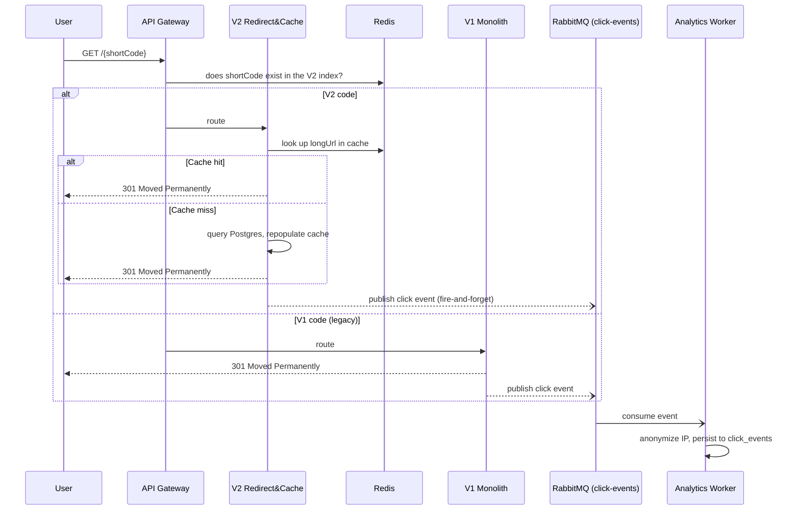

# Technical Architecture Documentation: URL Shortener Enterprise

## Executive Summary

This document is the result of a requirement-analysis, task-decomposition, and architecture-engineering process carried out by Art (engineer) with Claude's assistance, for a URL shortener prototype built over 2-3 days. The point of the exercise is not only to deliver a working shortener, but to demonstrate: requirement comprehension, task decomposition, AI-accelerated execution with full traceability and engineer ownership, and conscious risk/trade-off management under a fixed timebox.

This document covers the decisions already made, makes explicit the ones that were deliberately simplified for time budget reasons, and defines a day-by-day execution plan with cut lines so the scope stays defensible to any technical reviewer.

---

## 1. Requirement Understanding

**Original requirement (exercise brief):** build a URL shortener from scratch with core APIs, analytics, and "reliability features," demonstrating AI-accelerated engineering execution, in 2-3 days, covering three scenarios (greenfield, brownfield, ambiguous).

**Ambiguities detected and how they were normalized:**

- The brief specifies no stack, persistence layer, or auth/analytics depth → resolved through direct conversation with the stakeholder (see decisions in section 2).
- "Reliability features" is vague → normalized to: a read cache on the critical redirect path, asynchronous decoupling of analytics, versioned and auditable schema migrations, and explicit failure handling (Redis down, broker down, hash collision).
- The "brownfield" scenario cannot be literal, since no prior codebase exists (a pure greenfield project) → decided to **simulate** brownfield conditions: a minimal V1 is built and then, from that point on, deliberately treated as a legacy system for every later scenario — so reasoning about evolving existing code, impact analysis, and zero-regression can actually be demonstrated. This is stated explicitly here so it is never read as a real pre-existing legacy system.
- The expected level of "production" is undefined → interpreted as: production-quality code (modular, tested, secure) without needing to deploy to real, paid cloud infrastructure, given the 2-3 day timebox (see section 9, GKE Roadmap).

## 2. Assumptions

- Target prototype scale: hundreds of creations/day and thousands of redirects/day (enough to demonstrate the cache and async patterns, not real production traffic).
- Single-region, with no real multi-zone high-availability requirement (the path is documented, not implemented).
- No formal regulatory compliance requirements (GDPR/CCPA); IP anonymization is adopted as good practice, not as a response to a specific legal obligation.
- "V1" and "V2" links coexist under the same root domain; the short code must be indistinguishable in form to the end user (the shared link never exposes `/api/v1/` or `/api/v2/`).
- Access to GitHub Codespaces (or an equivalent local Docker setup) is assumed as the execution environment; access to a GCP account with active billing is not assumed for this exercise.

---

## 3. Architecture Overview

### 3.1 Components

- **API Gateway (Spring Cloud Gateway):** the single entry point. Applies the **Strangler Fig** pattern:
  - `/api/v1/...` (management control plane) → Legacy Monolith (V1).
  - `/api/v2/...` (management control plane) → modern Microservices (V2).
  - `GET /{shortCode}` (data plane, the actual redirect) → the Gateway does **not** decide by URL prefix (the public link must never carry `/api/`); instead it consults a shared code registry: it first checks whether the code exists in V2's index (Redis), and if not, delegates to the V1 Monolith. This is what makes Strangler Fig actually work for a shortener: the public domain is a single, stable one, even as the backend behind it changes over time.
- **Legacy Monolith (V1):** Java/Spring Boot. The original, deliberately simple shortening and basic-redirect system (see section 1). PostgreSQL with Liquibase for schema control.
- **Microservices (V2):**
  - **Shortener Service:** URL creation (custom alias, expiration, conditional redirect rules), protected with OAuth2/OIDC.
  - **Redirect & Cache Service:** high-speed reads; Redis cache-aside, falling back to PostgreSQL on a cache miss or when Redis is unresponsive.
  - **Analytics Worker:** an asynchronous RabbitMQ consumer (the `click-events` queue) that processes clicks from both V1 and V2 without blocking the redirect.
  - **Bulk Processor:** an asynchronous RabbitMQ consumer (the `bulk-url-jobs` queue, kept separate from `click-events` so the two kinds of traffic never mix) that processes mass URL creation.
- **Identity Provider (Keycloak):** issues and validates OIDC tokens. V2 services act as an OAuth2 Resource Server (they do not implement their own Authorization Server). It boots from a `realm-export.json` checked into the repo, so no manual configuration is required.

### 3.2 Technology Stack

| Category | Choice |
| --- | --- |
| Language | Java 17 / Spring Boot 3.x |
| Persistence | PostgreSQL (source of truth) |
| Cache | Redis (redirect cache-aside + rate limiting; **not** used for click counters) |
| Identity Provider | Keycloak (OIDC), services act as Resource Server |
| Messaging | RabbitMQ (separate queues: `click-events`, `bulk-url-jobs`) |
| Migrations | Liquibase |
| Testing | JUnit 5, MockMvc, Testcontainers |
| Execution environment | GitHub Codespaces (docker-outside-of-docker) + local kind/k3d cluster |

### 3.3 Control Flow (redirect)



### 3.4 Key Decisions

- **Strangler Fig, explicitly declared as a didactic brownfield simulation** (see section 1) — allows incremental modernization to be demonstrated without pretending a real legacy system exists.
- **Decoupling analytics via RabbitMQ:** keeps click counting from penalizing redirect latency. Accepted, documented risk: silent loss of an event if the broker is down at the moment of publishing (see section 8, Risks).
- **Redis for reads and rate limiting only, never as the source of truth for counters:** avoids inconsistency if Redis restarts; real counters are derived from the `click_events` table in Postgres.
- **Keycloak as the Identity Provider instead of a homegrown Authorization Server:** drastically reduces the effort of implementing "real" OAuth2/OIDC within the timebox.
- **Liquibase over native DDL:** auditable, reversible schema changes, critical for the brownfield scenario.

---

## 4. API & Data Model

### 4.1 Main Endpoints

**V1 (legacy, no auth):**

- `POST /api/v1/urls` `{ longUrl }` → `{ shortCode, shortUrl }`
- `GET /{shortCode}` → `301` (public redirect)

**V2 (modern):**

- `POST /api/v2/urls` *(auth required)* `{ longUrl, customAlias?, expiresAt?, redirectRules? }` → `{ shortCode, shortUrl, ownerId }`
- `GET /{shortCode}` → `301`/`302`, or `410 Gone` if expired (public redirect, no auth)
- `POST /api/v2/urls/bulk` *(auth required)* `{ urls: [{ longUrl, customAlias? }, ...] }` → `{ jobId, status: "PENDING", totalItems }`
- `GET /api/v2/urls/bulk/{jobId}` *(auth required)* → `{ status, totalItems, processedItems, failedItems, items: [...] }`
- `GET /api/v2/urls` *(auth required)* → the authenticated user's list of links
- `DELETE /api/v2/urls/{shortCode}` *(auth required, owner only)* → revocation
- `GET /api/v2/urls/{shortCode}/analytics` *(auth required, owner only)* → aggregated metrics from `click_events`

### 4.2 Data Model (summary)

- `urls` (V1): `id, short_code (unique), long_url, created_at, expires_at (nullable, added via Liquibase in the brownfield scenario)`
- `short_links` (V2): `id, short_code (unique), long_url, owner_user_id (FK, nullable if anonymous is allowed), redirect_rules (jsonb), created_at, expires_at, is_active`
- `app_user` (V2): `id, keycloak_subject (unique), email, created_at` — no passwords are stored locally; Keycloak is the identity source
- `click_events` (append-only, fed by both V1 and V2): `id, short_code, service_origin, occurred_at, anonymized_ip, user_agent, device_type, referrer`
- `bulk_jobs`: `id, owner_user_id, status, total_items, processed_items, failed_items, created_at, completed_at`
- `bulk_job_items`: `id, bulk_job_id (FK), line_index, long_url, status, short_code (nullable), error_message (nullable)`

---

## 5. Security

- **AuthN/AuthZ:** OIDC via Keycloak. Creation, bulk, listing, and analytics endpoints require a valid Bearer JWT; `GET /{shortCode}` (the redirect itself) stays public by design.
- **Open-redirect / phishing-abuse prevention:** every `longUrl` is validated against: an allowed scheme (`http`/`https` only), rejection of internal/private hosts (RFC 1918, `localhost`, cloud metadata endpoints) to prevent SSRF, with verification against a phishing/malware list (e.g. the Google Safe Browsing API) documented as a future improvement if time does not allow implementing it.
- **Rate limiting:** on `POST /api/v2/urls` and `/bulk`, using Redis (sliding window / token bucket) to mitigate unauthorized mass-creation abuse.
- **Secrets handling:**
  - In Codespaces: Postgres/RabbitMQ/Keycloak credentials are injected as *Codespaces secrets* (repo/user level), never committed.
  - In Kubernetes: as K8s `Secret` objects (with the documented caveat that this is only base64, not encryption at rest — future improvement: SOPS or sealed-secrets).
  - If a move toward real GCP happens: Workload Identity Federation instead of service-account JSON keys.
- **Reserved slugs:** codes such as `api`, `admin`, `health`, `actuator` stay on an exclusion list so they can never be assigned as a custom alias.

---

## 6. Three Scenarios

### Scenario A — Greenfield: the system, built from nothing

**Decomposition:**

1. Project scaffold: Maven reactor, devcontainer, CI pipeline, quality gates — before any business logic exists.
2. V1 legacy monolith (deliberately minimal — see section 1) plus the API Gateway's Strangler Fig routing.
3. V2 REST contract for URL creation and resolution, OAuth2/OIDC via Keycloak.
4. Redis integration (cache-aside) for the Redirect & Cache Service, with a Base62 hash generator and collision handling (retry + fallback to a longer length).
5. Async services (Analytics Worker, Bulk Processor) over RabbitMQ, and rate limiting.
6. Unit tests and Testcontainers integration tests throughout.

**AI-Assisted Execution (traceability):**

- Initial prompt: *"Act as a Spring Boot expert. Generate a redirect service that queries Redis and falls back to PostgreSQL when the cache expires."*
- Human intervention: the AI did not handle Redis being down (not just a cache miss, but a refused connection). The initial proposal was rejected and a Circuit Breaker (Resilience4j) was added so a Redis outage cannot take down redirects — it degrades to querying Postgres directly instead.

**Validation:** every Greenfield PR carries unit and Testcontainers integration coverage (see section 10); the Redirect & Cache Service specifically has a manual chaos test — stopping the Redis container mid-test to verify the Postgres fallback produces no 5xx errors.

### Scenario B — Brownfield: evolving the V1 Monolith

Demonstrated with two concrete, executable test scenarios (not narrative alone), each its own PR:

1. **V1-only baseline** — a deploy profile running **only** V1 + Postgres, with V2, Keycloak, Redis, and RabbitMQ entirely absent, plus an end-to-end test proving create-and-redirect works completely standalone. This is the literal "legacy system as found" starting point every brownfield story needs.
2. **V2 cutover alongside V1** — V2 services are activated next to the still-running V1. A test proves: short codes created **before** the cutover still redirect correctly via V1, codes created **after** go through V2, and both resolve under the same public domain with no visible difference to an end user — the actual Strangler Fig claim, proven rather than only described.

**Decomposition (schema evolution, underlying both scenarios):**

1. Impact analysis of V1's current schema.
2. A Liquibase changelog (`changelog-v1.2.xml`) adding `expires_at` without breaking existing rows.
3. Characterization tests (JUnit + MockMvc) that freeze V1's current behavior before touching it.
4. A surgical refactor so V1 also publishes click events to RabbitMQ.

**AI-Assisted Execution (traceability):**

- Initial prompt: *"Generate a Liquibase script that adds an expiration column to the legacy URLs table."*
- Human intervention: the AI proposed the column as `nullable="false"`, which would have broken existing rows. This was rejected and adjusted to `nullable="true"` with a default value, preserving backward compatibility.

**Validation:** characterization tests run before and after the change — zero regressions in V1's API responses — plus the two dedicated scenario tests above.

### Scenario C — Ambiguous: "smart, private links"

**Original business requirement:** *"We want links to be smart, expire properly, respect privacy, but still give us metrics."*

**Disambiguation (tech lead's assumptions):** "Smart" → simple conditional redirect by device type (mobile vs. desktop) via `redirect_rules`. "Expire properly" → an `expires_at` field, returning `410 Gone` once past due. "Respect privacy" → anonymize the last octet of the IP before persisting the click event.

**Decomposition:**

1. Extend the creation DTO to accept `redirectRules` and `expiresAt`.
2. IP-anonymization middleware in the analytics pipeline (before inserting into `click_events`).
3. Expiration validation at redirect time.

Each interpretation above is now backed by an executable test — a dedicated PR turns this section's disambiguation bullets into assertions, naming which ambiguity each test settles, rather than leaving the resolution as prose alone.

**Validation:** unit tests verifying the anonymized IP format (`192.168.1.0` instead of `192.168.1.45`) and that an expired link responds `410` instead of redirecting.

---

## 7. Day-by-Day Execution Plan

Availability assumption: 6-8 dedicated hours per day. Global priority if time runs short (confirmed with the stakeholder): **protect all 3 complete scenarios above everything else** — the cut order is (1) live Kubernetes → falls back to docker-compose with the manifests versioned but unexecuted, (2) full OIDC → falls back to a simple JWT with Spring Security, (3) asynchronous bulk → falls back to synchronous bulk. A scenario is never cut halfway to save an infrastructure piece.

**Day 1 — Construction (Greenfield foundation)**

The system is built as if for the first time, with no legacy assumption yet — this day's PRs are the foundation everything else stands on.

- Must-ship: monorepo scaffold; Codespaces devcontainer (docker-outside-of-docker + the kind/k3d feature); docker-compose (Postgres, Redis, RabbitMQ, Keycloak); minimal V1 monolith (initial Liquibase, create + redirect, no auth); Gateway with Strangler Fig routing; the V2 OpenAPI contract plus the Base62 generator; the V2 Shortener Service (creation, OAuth2 resource server); the Redirect & Cache Service (Redis cache-aside, Circuit Breaker); the Analytics Worker; the Bulk Processor; rate limiting on the create endpoints; Kubernetes manifests for local `kind` deployment; CI pipeline and quality gates from commit one.
- Emergency cut: the Gateway can stay a stub with no real routing if time is short.

**Day 2 — Brownfield scenarios**

Two scenarios that only make sense once Day 1's system exists: proving the "legacy-only" starting point, then proving the modernization cutover does not break it.

- Must-ship: the V1-only baseline scenario (a deploy profile / compose override running only V1, plus an end-to-end test proving it works completely standalone); the V2-cutover scenario (V2 activated alongside the still-running V1, with a test proving pre-cutover and post-cutover links both resolve correctly under the same public domain).
- Emergency cut: if the standalone V1 profile takes too long to wire cleanly, document it as a manual docker-compose demonstration instead of an automated test, without dropping the scenario itself.

**Day 3 — Ambiguous scenario, audit-trail demonstration, and documentation**

- Must-ship: executable tests validating the interpretations chosen for the Ambiguous scenario's underspecified requirements (section 6, Scenario C); a deliberate audit-trail demonstration — a PR that commits a plaintext, low-entropy fake credential (the same shape as a real finding from this project's history), meant to be caught and rejected in human review rather than fixed, so the rejection itself — not a merge — is the recorded proof that the review guardrail works even when Secret Scanning does not flag the value; final documentation (README, `AI_USAGE_LOG.md`, Postman collection).
- Emergency cut: if Kubernetes gives resource trouble inside Codespaces, the whole stack is demonstrated with docker-compose and the K8s manifests stay versioned but not executed live (an accepted, declared limitation, not a hidden one).

---

## 8. AI-Assisted Execution & Traceability

Beyond the scenario-specific examples (section 6), an `AI_USAGE_LOG.md` file is kept in the repo with one entry per relevant decision across all three days, in this format:

```text
### [Date] [Component] Prompt: "..."
- AI-generated: <what it produced>
- Accepted / Modified / Rejected: <decision>
- Reason: <why, in the engineer's own judgment>
```

This gives continuous traceability (not just 3 isolated examples) to support "depth of decomposition" and "effectiveness of AI-assisted engineering execution" for any reviewer.

---

### 8.1 Git and Pull Request Flow

- **Branches:** one branch per plan task (section 7), named `feature/<scenario-or-task>` (e.g. `feature/greenfield-redirect-service`, `feature/brownfield-liquibase-expiration`), so the branch/PR history mirrors the already-documented task decomposition exactly.
- **Two real GitHub identities, not just a commit-message convention:** `arturomendezarg` (the engineer, repo owner) and `claude-dev-art` (a dedicated account, added as a collaborator with write access, used exclusively for AI-generated work). This turns PR review into a real, GitHub-enforced review — the engineer cannot approve their own PRs, so when AI-assisted task PRs are opened by `claude-dev-art`, `arturomendezarg`'s approval is a genuine review, not an administrator bypass.
- **Commits:** Conventional Commits. AI-generated commits use `claude-dev-art`'s git identity (name `Claude AI Assistant`, that account's verified email) so GitHub correctly attributes author/avatar in the history. The engineer's own manual-adjustment commits use `arturomendezarg`'s identity. Hard rule: never `git commit --amend` an AI commit after a human adjustment — always a new commit, so the "AI-proposed vs. engineer-corrected" diff stays permanently visible in the history, with authorship distinguishable by account.
- **Triggering the work:** manual, from inside the Codespace. The engineer decides when to invoke Claude Code for each task; changes are committed and pushed under the `claude-dev-art` identity, and the engineer reviews the diff before approving. Automation via a GitHub Action (`@claude` on an issue opening the PR on its own) was ruled out as the primary method, because the exercise's brief explicitly asks for "engineer-led execution accelerated by AI, not autonomous orchestration"; it is documented as an available additional capability, used occasionally and always with manual approval, not as the default flow.
- **PR template** (`.github/PULL_REQUEST_TEMPLATE.md`) with fixed sections: original task/intent, prompt(s) used, summary of what the AI generated, quality-gate results (build, tests, lint, dependency scan — section 11), and a required **"Engineer's Decision"** field with three cases:
  - *Accepted:* `arturomendezarg` approves the PR opened by `claude-dev-art` and merges it.
  - *Rejected:* the PR is closed without merging, with a review comment explaining why, and the corresponding entry is added to `AI_USAGE_LOG.md` (section 8) — the reason lives both in the PR's technical history and in the project's narrative summary.
  - *Adjusted:* a new commit is added on the same branch, under `arturomendezarg`'s identity (or a new `claude-dev-art` iteration if the AI is asked to fix something specific); the PR keeps every commit visible, with authorship distinguishable, and the original is never rewritten.
- **Branch protection on `main`:** direct pushes blocked for everyone, including the repo owner (`enforce_admins: true`); merges only via PR with 1 required approval and, once the CI pipeline exists (section 11), green checks. With two real accounts in play, the required approval is a genuine human review, not a formality.
- **PR labels:** `ai:accepted`, `ai:rejected`, `ai:adjusted` so the PR history is scannable at a glance by any external reviewer without reading every single one.

---

### 8.2 Secure AI Usage

Concrete controls (not just stated — verified via the GitHub API at the time of writing) that bound what the AI can do and what it can access:

- **Never a real credential:** every Postgres/RabbitMQ/Keycloak password in `docker-compose.yml` is a made-up local development value (`urlshortener_local`, `admin_local`), defaulted in the file itself — there is no real secret to protect in this exercise. `.env` is in `.gitignore` (with an explicit exception for `.env.example`, which only holds placeholders) so the pattern is still correct in case a real value is ever used. `*.pem` and `*.key` are excluded too.
- **No access to production infrastructure:** the AI never received GCP credentials or any real cloud provider's credentials — Kubernetes deployment is local (kind/k3d in Codespaces), and GKE stays a *documented roadmap*, never executed (see section 9). The blast radius of any AI error or misuse is bounded to a disposable environment.
- **The AI's execution environment has restricted network access:** the sandbox this AI runs in during this session has a narrow network allowlist (in practice, it could not even reach Maven Central to compile locally — see `AI_USAGE_LOG.md`). This was not a measure configured specifically for this project, but it is a real containment layer worth stating: the AI cannot exfiltrate data or reach arbitrary internet endpoints from its own working environment.
- **Secret scanning (`gitleaks`) on every PR:** an automatic guardrail specifically against the "the AI accidentally commits a credential" scenario — it has run in CI since the repo's very first PR, even before any Java code existed.
- **Dependency scanning (Dependabot):** any library the AI proposes adding to `pom.xml` stays under continuous known-vulnerability monitoring, rather than blind trust that "the AI picked a reasonable version" (see section 11).
- **Zero administrator bypass, verified:** `enforce_admins: true` on `main`'s protection — confirmed via `GET /repos/.../branches/main/protection`, not just stated in prose. Not even the repo owner can skip the PR + review + green-CI flow. Combined with `required_approving_review_count: 1` and `dismiss_stale_reviews: true` (any new commit on an already-approved PR — such as this same day's post-CI fixes — invalidates the previous approval and requires a fresh review), the only path for an `claude-dev-art`-generated change to reach `main` is for `arturomendezarg` to actively review it, every time. This is the exact guardrail exercised, deliberately, by the plaintext-credential PR in section 7's Day 3 plan: even when Secret Scanning does not flag a low-entropy fake value, this required human review is what catches it, and the PR's rejection — never merged — is the recorded proof.
- **Least privilege on the bot's token:** `claude-dev-art`'s token has `repo`, `read:org`, `workflow` scopes — necessary to open PRs and push to `.github/workflows/`, but no `admin:org` or repo-administration permissions (confirmed: `admin: false` in that account's collaborator permissions). It cannot change branch protection, delete the repo, or manage other collaborators.

---

## 9. Setup Instructions

**Recommended environment: GitHub Codespaces**

1. `<> Code` button → Codespaces tab → `Create codespace on main`. The devcontainer preconfigures Java 17, Maven, Docker (the `docker-outside-of-docker` feature, not Docker-in-Docker — a correction to an earlier version of this paragraph: `kind` recommends avoiding DinD when the host already exposes its own Docker socket, which is exactly what that feature does) and `kubectl`/`kind`/`helm`, installed directly by `.devcontainer/setup.sh` (that script documents why: the third-party Kubernetes feature failed to build in the devcontainer's first version).
2. Bring up infrastructure dependencies for day-to-day development:

   ```bash
   docker-compose up -d
   ```

3. Run the services:

   ```bash
   mvn clean spring-boot:run
   ```

4. To demonstrate the local Kubernetes deployment (a single-node cluster, with all 5 services
   and their infrastructure running inside the cluster itself, not reusing step 2's
   `docker-compose` — the two cannot run at once, they claim the same host ports on purpose):

   ```bash
   docker-compose down
   which k3d || curl -s https://raw.githubusercontent.com/k3d-io/k3d/main/install.sh | bash
   ./infra/k8s/deploy-to-k3d.sh
   ```

   **k3d, not kind.** `kind` cannot bootstrap a control plane inside a Codespace at all (7
   attempts, elimination table in `infra/k8s/README.md`); k3d runs k3s, which never invokes
   `kubeadm`, and does. This is the path that was actually verified end-to-end: all 9 pods
   `Ready`, a JWT from the in-cluster Keycloak accepted by `v2-shortener-service`, and the V1
   and V2 redirect paths exercised over real HTTP. `deploy-to-kind.sh` is kept for an ordinary
   Docker host, where `kind` works, but has never been seen to succeed from this repo.

   Full detail (how to reach each service from outside the cluster, design decisions,
   troubleshooting, teardown) is in [`infra/k8s/README.md`](./infra/k8s/README.md).

**Postman testing (planned, not yet created):** `docs/url-shortener-enterprise.postman_collection.json` is referenced throughout this project's history as the intended way to exercise V1, V2, expiration and async bulk with preconfigured environments, but the file itself was never committed — stated here plainly rather than left implied by the surrounding references. Until it exists, `README.md` ('For reviewers') gives the equivalent `curl` steps, and `infra/k8s/README.md` ('Smoke test') has the transcript actually run against the Kubernetes deployment. Tracked as follow-up work, alongside the Gateway routing fix in `infra/k8s/README.md`'s Known defect.

**GKE Roadmap (documented, not executed in this exercise):** Artifact Registry for images, GKE Autopilot, Cloud SQL for Postgres, Memorystore for Redis, Workload Identity Federation instead of service-account keys. This path is documented to demonstrate productization judgment without spending the prototype's timebox on GCP credentials and billing.

---

## 10. Testing Approach

- **Unit tests:** isolated business logic (hash generator, expiration rules, IP anonymization) with JUnit 5 and Mockito.
- **Characterization tests:** exclusive to the Brownfield scenario, they lock in V1's current behavior before refactoring.
- **Integration:** Testcontainers spinning up real Postgres, Redis, and RabbitMQ, verifying Liquibase migrations run the same way they would in production.
- **Manual chaos:** stopping Redis/RabbitMQ during a test to verify the documented fallbacks (Circuit Breaker, degradation to Postgres) actually work.

## 11. Observability & Quality Gates

**Status:** the pieces in this section are already implemented (not merely planned) as of the "quality gates" PR (see `AI_USAGE_LOG.md`) — stated explicitly so the moment they stopped being a design promise and became real code stays traceable.

- **Static analysis (Checkstyle + SpotBugs):** declared as `<build><plugins>` in the root `pom.xml` (not `<pluginManagement>`), so child modules inherit and run them automatically during the `verify` phase with no repeated configuration. Checkstyle uses its own, deliberately narrow ruleset (`checkstyle.xml`, at the repo root) — it starts as a real gate (it can fail the build) without generating a wave of style violations against already-written code; it can be hardened progressively. SpotBugs analyzes compiled bytecode for known bug patterns, at a "Medium" threshold.
- **Dependency scanning (security):** **GitHub Dependabot** (`.github/dependabot.yml` + repo-level vulnerability alerts) was chosen over OWASP Dependency-Check as a Maven plugin, which was the original plan. Reason for the change: Dependency-Check depends on the NVD API, which applies an aggressive rate limit without a registered API key and can make the CI job slow or flaky — a poor fit for a pipeline that runs on every PR of a time-boxed exercise. Dependabot is native to GitHub, needs no extra infrastructure, and covers the same goal.
- **Observability (Micrometer/Actuator):** `spring-boot-starter-actuator` + `micrometer-registry-prometheus` in the V1 Monolith and the API Gateway (the two runnable services so far), with `/actuator/health`, `/actuator/info`, and `/actuator/prometheus` exposed — enough to check latency and health live without standing up a full Grafana stack for this exercise. Pending: adding the same to the V2 services as they are built (Day 1/2).
- **Performance:** there is honestly no automated performance gate yet (e.g. a latency threshold that fails the build). The planned performance validation (load test + Redis chaos test, see section 6 Scenario A) is manual and executable, not a CI gate — stated explicitly rather than implying coverage that doesn't exist.
- **CI pipeline** (`.github/workflows/ci.yml`), runs on every PR against `main` and on every push to `main`, with three jobs:
  - *Markdown Lint* — validates documentation (`.markdownlint-cli2.jsonc` disables noisy rules like line length and inline HTML, needed because of the Mermaid diagrams).
  - *Secret Scanning* (`gitleaks`) — has run since the repo's very beginning, even when it held only documentation, so a credential is never allowed to slip into the history.
  - *Build and Test* — runs `mvn verify`, which is where Checkstyle and SpotBugs (static analysis) are integrated as Maven plugins — not as separate CI steps.
- These three jobs are *required status checks* on `main`'s protection (section 8.1).

## 12. Risks & Guardrails

| Risk | Guardrail / decision |
| --- | --- |
| Silent loss of click events if RabbitMQ is down when publishing (fire-and-forget) | Accepted as a risk for analytics (non-critical); explicitly documented, not hidden. Future improvement: outbox pattern. |
| Base62 hash collision under extreme concurrency | Database-level uniqueness constraint + retry; future improvement: a Snowflake-style ID generator. |
| The shortener used for phishing/open redirect | Scheme and internal-host validation at creation time (section 5); an external blocklist stays a future improvement if time runs short. |
| A Redis outage affects redirect latency | Circuit Breaker with a direct Postgres fallback (Scenario A). |
| Limited Codespace resources for running kind + every service | Cut plan: demonstrate with docker-compose if kind is not viable, without blocking the rest of the deliverable. |

## 13. Limitations

- Eventual consistency in analytics (a few seconds) from the RabbitMQ decoupling — acceptable for this domain, not for strictly transactional systems.
- No persistent storage (volumes) in the kind/k3d cluster — valid for a demo, not for production.
- **`kind` cannot bootstrap a cluster inside GitHub Codespaces** — verified empirically, not assumed. Across seven attempts, the control plane never completed bootstrap: it always failed in the steps `kind` runs immediately after `kubeadm init` (removing the control-plane taint / the load-balancer exclusion label, or exporting the kubeconfig), with the apiserver refusing connections on `:6443` or `/etc/kubernetes/admin.conf` missing. Hypotheses were eliminated one by one: `inotify` limits (already high), CPU/memory (upgraded from 2 to 4 cores and 8 to 16 GB, with 13 GB free, and it still failed), disk space (23 GB free), `kind` version (v0.24.0 and the latest), Kubernetes version (v1.31.0, v1.34.0, v1.37.0), and finally **this repo's own configuration** — a cluster created with *no config file at all* fails identically, which is what exonerates `kind-config.yaml` and the manifests. The full attempt table is in `infra/k8s/README.md` (Troubleshooting). **Resolved by changing tools, not by giving up on Kubernetes:** the same manifests run unmodified on **k3d** (k3s in Docker), which never invokes `kubeadm` and so is not subject to this failure class at all — `./infra/k8s/deploy-to-k3d.sh`, verified end-to-end (9 pods `Ready`, real JWT accepted, both redirect paths exercised). `kind` remains supported for an ordinary Docker host and remains unverified from here. The `docker-compose` fallback declared in section 12's risk table was never needed for this purpose.
- **The Gateway decides V1-vs-V2 from a cache, not from an index — open defect.** `DynamicShortCodeRoutingFilter` treats the presence of `shortlink:v2:<code>` in Redis as proof that a code lives in V2, but that key is `ShortLinkCache`'s read-through cache: written only when a link is *read*, with a 300-second TTL, and never written at creation. So a freshly created V2 link is routed to V1 and 404s until something reads it directly, and a working V2 link starts 404ing again once its entry expires. Demonstrated on the running cluster — the identical request answered `404` then `302` either side of a direct read. Closing it is a design change (a durable ownership record, or no shared state at all with the Gateway trying V2 and falling back to V1 on 404), tracked separately rather than patched in place; see `infra/k8s/README.md` ("Known defect") and `AI_USAGE_LOG.md`.
- No verification against external phishing/malware lists (stays a documented future improvement).
- No real GCP deployment within this exercise's timebox (see the GKE Roadmap).

## 14. Trade-offs

- **Monolith + Microservices (Strangler Fig) vs. building everything at once:** more operational complexity in exchange for demonstrating incremental modernization without abruptly shutting down a system in use — valid here as a didactic exercise, already declared as a simulation in section 1.
- **Redis cache vs. querying the DB directly:** redirect latency is prioritized in exchange for taking on the classic cache-invalidation problem, mitigated with a short TTL and a Circuit Breaker.
- **Keycloak vs. a homegrown Authorization Server:** delivery time is prioritized in exchange for one more piece of infrastructure to administer.
- **Asynchronous vs. synchronous bulk:** a more sophisticated pattern is prioritized (reusing RabbitMQ) in exchange for more state complexity (jobs, idempotency, dead-letter queue).
