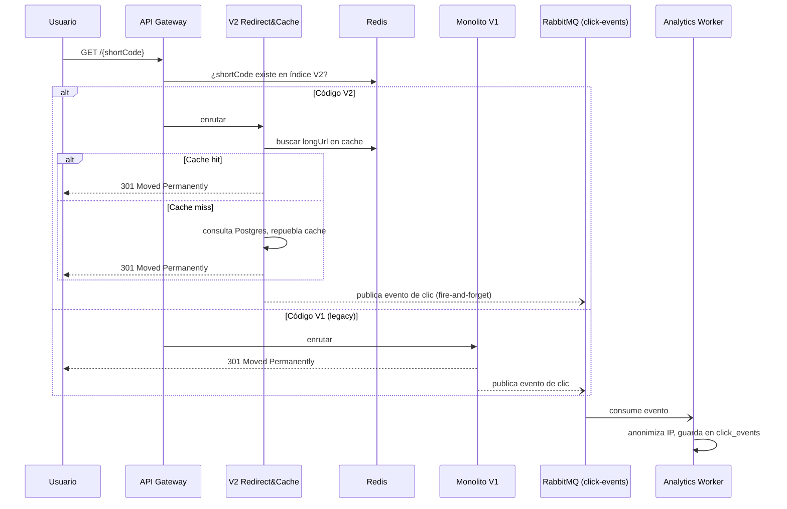

# Documentación Técnica de Arquitectura: URL Shortener Enterprise

## Resumen ejecutivo

Este documento es el resultado de un proceso de análisis de requerimientos, decomposición de tareas e ingeniería de arquitectura realizado por Art (ingeniero) con asistencia de Claude, para un prototipo de URL shortener a construir en 2-3 días. El objetivo del ejercicio no es solo entregar un shortener funcional, sino demostrar: comprensión de requerimientos, decomposición de tareas, ejecución acelerada por IA con trazabilidad y ownership del ingeniero, y manejo consciente de riesgos y trade-offs bajo un tiempo acotado.

Este documento cubre las decisiones ya tomadas, deja explícitas las que fueron deliberadamente simplificadas por presupuesto de tiempo, y define un plan de ejecución día a día con líneas de corte para que el alcance sea defendible ante cualquier revisor técnico.

---

## 1. Requirement Understanding

**Requerimiento original (brief del ejercicio):** construir un URL shortener desde cero con APIs core, analíticas y "reliability features", demostrando ejecución de ingeniería acelerada por IA, en 2-3 días, cubriendo tres escenarios (greenfield, brownfield, ambiguo).

**Ambigüedades detectadas y cómo se normalizaron:**

- El brief no especifica stack, persistencia, ni nivel de auth/analíticas → se resolvió en conversación directa con el stakeholder (ver decisiones en la sección 2).
- "Reliability features" es vago → se normalizó a: cache de lectura para el path crítico de redirección, desacoplamiento asíncrono de analíticas, migraciones versionadas y auditable del esquema, y manejo explícito de fallos (Redis caído, broker caído, colisión de hash).
- El escenario "brownfield" no puede ser literal porque no existe codebase previo (proyecto greenfield puro) → se decidió **simular** condiciones brownfield: se construye un V1 mínimo el Día 1 y se trata como sistema heredado a partir del Día 2, para poder demostrar razonamiento de evolución de código existente, análisis de impacto y regresión cero. Esto se declara explícitamente aquí para que no se lea como un sistema legacy real preexistente.
- El nivel de "producción" esperado no está definido → se interpretó como: código con calidad de producción (modular, testeado, seguro) pero sin necesidad de desplegar a infraestructura cloud real paga, dado el timebox de 2-3 días (ver sección 9, Roadmap a GKE).

## 2. Assumptions (supuestos de partida)

- Escala objetivo del prototipo: cientos de creaciones/día y miles de redirecciones/día (suficiente para demostrar el patrón de cache y async, no tráfico de producción real).
- Single-region, sin requisitos de alta disponibilidad multi-zona real (se documenta el camino, no se implementa).
- No hay requisitos de compliance regulatorio formal (GDPR/CCPA); la anonimización de IP se adopta como buena práctica, no como respuesta a una obligación legal específica.
- Los enlaces "V1" y "V2" conviven bajo el mismo dominio raíz; el código corto debe ser indistinguible en forma para el usuario final (no se expone `/api/v1/` ni `/api/v2/` en el link que se comparte).
- Se asume acceso a GitHub Codespaces (o Docker local equivalente) como entorno de ejecución; no se asume acceso a una cuenta de GCP con billing activo para este ejercicio.

---

## 3. Architecture Overview

### 3.1 Componentes

- **API Gateway (Spring Cloud Gateway):** único punto de entrada. Aplica el patrón **Strangler Fig**:
  - `/api/v1/...` (plano de control de gestión) → Monolito Legacy (V1).
  - `/api/v2/...` (plano de control de gestión) → Microservicios modernos (V2).
  - `GET /{shortCode}` (plano de datos, la redirección real) → el Gateway **no** decide por prefijo de URL (el link público nunca debe llevar `/api/`), sino consultando un registro compartido de códigos: primero revisa si el código existe en el índice de V2 (Redis), y si no, delega al Monolito V1. Esto es lo que hace que Strangler Fig funcione de verdad para un shortener: el dominio público es uno solo y estable, aunque el backend detrás cambie con el tiempo.
- **Legacy Monolith (V1):** Java/Spring Boot. Sistema original de acortamiento y redirección básica, deliberadamente simple (ver sección 1). PostgreSQL con Liquibase para control de esquema.
- **Microservicios (V2):**
  - **Shortener Service:** creación de URLs (alias personalizado, expiración, reglas de redirección condicional), protegido con OAuth2/OIDC.
  - **Redirect & Cache Service:** lectura de alta velocidad; cache-aside con Redis, fallback a PostgreSQL si hay cache-miss o Redis no responde.
  - **Analytics Worker:** consumidor asíncrono de RabbitMQ (cola `click-events`) que procesa clics de V1 y V2 sin bloquear la redirección.
  - **Bulk Processor:** consumidor asíncrono de RabbitMQ (cola `bulk-url-jobs`, separada de `click-events` para no mezclar tráfico) que procesa creación masiva de URLs.
- **Identity Provider (Keycloak):** emite y valida tokens OIDC. Los servicios V2 actúan como OAuth2 Resource Server (no implementan su propio Authorization Server). Se arranca con un `realm-export.json` versionado en el repo para no requerir configuración manual.

### 3.2 Stack tecnológico

| Categoría | Elección |
|---|---|
| Lenguaje | Java 17 / Spring Boot 3.x |
| Persistencia | PostgreSQL (fuente de verdad) |
| Cache | Redis (redirect cache-aside + rate limiting; **no** para contadores de clicks) |
| Identity Provider | Keycloak (OIDC), servicios como Resource Server |
| Mensajería | RabbitMQ (colas separadas: `click-events`, `bulk-url-jobs`) |
| Migraciones | Liquibase |
| Pruebas | JUnit 5, MockMvc, Testcontainers |
| Entorno de ejecución | GitHub Codespaces (Docker-in-Docker) + clúster local kind/k3d |

### 3.3 Flujo de control (redirección)



### 3.4 Key Decisions

- **Strangler Fig, declarado explícitamente como simulación didáctica de brownfield** (ver sección 1) — permite demostrar modernización incremental sin fingir que existe un sistema heredado real.
- **Desacoplamiento de analíticas vía RabbitMQ:** evita que el conteo de clics penalice la latencia de redirección. Riesgo aceptado y documentado: pérdida silenciosa de un evento si el broker está caído en el instante de publicación (ver sección 8, Riesgos).
- **Redis solo para lectura y rate limiting, nunca como fuente de verdad de contadores:** evita inconsistencia si Redis se reinicia; los contadores reales se derivan de la tabla `click_events` en Postgres.
- **Keycloak como Identity Provider en vez de un Authorization Server propio:** reduce drásticamente el esfuerzo de implementar OAuth2/OIDC "real" dentro del timebox.
- **Liquibase sobre DDL nativo:** cambios de esquema auditables y reversibles, crítico para el escenario brownfield.

---

## 4. API & Data Model

### 4.1 Endpoints principales

**V1 (legacy, sin auth):**
- `POST /api/v1/urls` `{ longUrl }` → `{ shortCode, shortUrl }`
- `GET /{shortCode}` → `301` (redirección pública)

**V2 (moderno):**
- `POST /api/v2/urls` *(auth requerido)* `{ longUrl, customAlias?, expiresAt?, redirectRules? }` → `{ shortCode, shortUrl, ownerId }`
- `GET /{shortCode}` → `301`/`302`, o `410 Gone` si expiró (redirección pública, sin auth)
- `POST /api/v2/urls/bulk` *(auth requerido)* `{ urls: [{ longUrl, customAlias? }, ...] }` → `{ jobId, status: "PENDING", totalItems }`
- `GET /api/v2/urls/bulk/{jobId}` *(auth requerido)* → `{ status, totalItems, processedItems, failedItems, items: [...] }`
- `GET /api/v2/urls` *(auth requerido)* → lista de links del usuario autenticado
- `DELETE /api/v2/urls/{shortCode}` *(auth requerido, solo dueño)* → revocación
- `GET /api/v2/urls/{shortCode}/analytics` *(auth requerido, solo dueño)* → métricas agregadas desde `click_events`

### 4.2 Modelo de datos (resumen)

- `urls` (V1): `id, short_code (unique), long_url, created_at, expires_at (nullable, agregado vía Liquibase en el escenario brownfield)`
- `short_links` (V2): `id, short_code (unique), long_url, owner_user_id (FK, nullable si se permite anónimo), redirect_rules (jsonb), created_at, expires_at, is_active`
- `app_user` (V2): `id, keycloak_subject (unique), email, created_at` — no se almacenan passwords localmente, Keycloak es la fuente de identidad
- `click_events` (append-only, alimentada por V1 y V2): `id, short_code, service_origin, occurred_at, anonymized_ip, user_agent, device_type, referrer`
- `bulk_jobs`: `id, owner_user_id, status, total_items, processed_items, failed_items, created_at, completed_at`
- `bulk_job_items`: `id, bulk_job_id (FK), line_index, long_url, status, short_code (nullable), error_message (nullable)`

---

## 5. Security

- **AuthN/AuthZ:** OIDC vía Keycloak. Endpoints de creación, bulk, listado y analíticas requieren Bearer JWT válido; `GET /{shortCode}` (la redirección) permanece público por diseño.
- **Prevención de open redirect / abuso de phishing:** toda `longUrl` se valida contra: esquema permitido (`http`/`https` solamente), rechazo de hosts internos/privados (RFC 1918, `localhost`, metadata endpoints de cloud) para evitar SSRF, y se documenta como mejora futura la verificación contra una lista de phishing/malware (ej. Google Safe Browsing API) si el tiempo no alcanza para implementarla.
- **Rate limiting:** en `POST /api/v2/urls` y `/bulk`, usando Redis (ventana deslizante o token bucket) para mitigar abuso de creación masiva no autorizada.
- **Manejo de secretos:**
  - En Codespaces: credenciales de Postgres/RabbitMQ/Keycloak se inyectan como *Codespaces secrets* (repo/usuario), nunca se commitean.
  - En Kubernetes: como `Secret` de K8s (con la salvedad documentada de que es solo base64, no cifrado en reposo — mejora futura: SOPS o sealed-secrets).
  - Si se avanza hacia GCP real: Workload Identity Federation en vez de llaves JSON de service account.
- **Slugs reservados:** códigos como `api`, `admin`, `health`, `actuator` quedan en una lista de exclusión para que nunca se asignen como alias personalizado.

---

## 6. Three Scenarios

### Escenario A — Greenfield: Redirect & Cache Service de alta velocidad

**Descomposición:**
1. Contrato REST V2 para creación y resolución de URLs.
2. Integración con Spring Data Redis (cache-aside).
3. Generador de hash Base62 con manejo de colisiones (reintento + fallback a mayor longitud).
4. Pruebas unitarias e integración con Testcontainers.

**AI-Assisted Execution (trazabilidad):**
- Prompt inicial: *"Actúa como experto en Spring Boot. Genera un servicio de redirección que consulte Redis y haga fallback a PostgreSQL si el caché expira."*
- Intervención humana: la IA no manejó el caso de Redis caído (no solo cache-miss, sino conexión rechazada). Se rechazó la propuesta inicial y se añadió un Circuit Breaker (Resilience4j) para que una caída de Redis no tumbe el redirect, degradando a consulta directa a Postgres.

**Validation:** prueba de carga local simulando concurrencia, verificando que el fallback a Postgres no genera errores 5xx cuando Redis está caído (chaos test manual: apagar el contenedor de Redis a mitad de la prueba).

### Escenario B — Brownfield: Evolución del Monolito V1

**Descomposición:**
1. Análisis de impacto del esquema actual de V1.
2. Changelog de Liquibase (`changelog-v1.2.xml`) agregando `expires_at` sin romper filas existentes.
3. Characterization tests (JUnit + MockMvc) para congelar el comportamiento actual de V1 antes de tocarlo.
4. Refactor quirúrgico para que V1 también publique eventos de clic a RabbitMQ.

**AI-Assisted Execution (trazabilidad):**
- Prompt inicial: *"Genera un script de Liquibase para agregar una columna de expiración a la tabla legacy de URLs."*
- Intervención humana: la IA propuso la columna como `nullable="false"`, lo cual rompería las filas existentes. Se rechazó y se ajustó a `nullable="true"` con valor por defecto, preservando compatibilidad hacia atrás.

**Validation:** characterization tests ejecutados antes y después del cambio — cero regresiones en las respuestas de la API V1.

### Escenario C — Ambiguous: "Enlaces inteligentes y privados"

**Requerimiento original del negocio:** *"Queremos que los enlaces sean inteligentes, expiren bien y respeten la privacidad pero den métricas."*

**Desambiguación (supuestos del tech lead):** "Inteligente" → redirección condicional simple por tipo de dispositivo (móvil vs. desktop) vía `redirect_rules`. "Expirar bien" → campo `expires_at`, devolviendo `410 Gone` si venció. "Respetar privacidad" → anonimizar el último octeto de la IP antes de persistir el evento de clic.

**Descomposición:**
1. Extender el DTO de creación para aceptar `redirectRules` y `expiresAt`.
2. Middleware de anonimización de IP en el pipeline de analíticas (antes de insertar en `click_events`).
3. Validación de caducidad en el momento de la redirección.

**Validation:** pruebas unitarias verificando formato anonimizado de IP (`192.168.1.0` en vez de `192.168.1.45`) y que un enlace vencido responde `410` en vez de redirigir.

---

## 7. Plan de Ejecución (Día a Día)

Supuesto de disponibilidad: 6-8 horas dedicadas por día. Prioridad global si el tiempo se acorta (confirmada con el stakeholder): **proteger los 3 escenarios completos por encima de todo** — el orden de recorte es (1) Kubernetes corriendo en vivo → cae a docker-compose con manifiestos versionados pero no ejecutados, (2) OIDC completo → cae a JWT simple con Spring Security, (3) Bulk asíncrono → cae a bulk síncrono. Nunca se recorta un escenario a medias para salvar una pieza de infraestructura.

**Día 1 — Cimientos + V1 mínimo + arranque Greenfield**
- Must-ship: scaffold del monorepo; devcontainer de Codespaces (Docker-in-Docker + feature kind/k3d); docker-compose (Postgres, Redis, RabbitMQ, Keycloak); V1 monolito mínimo (Liquibase inicial, crear + redirigir, sin auth); Gateway con rutas básicas; contrato OpenAPI V2 + generador Base62.
- Corte de emergencia: Gateway puede quedar como stub sin enrutamiento real si hace falta tiempo.

**Día 2 — Brownfield + Redirect&Cache (Greenfield) + Auth**
- Must-ship: escenario Brownfield completo (Liquibase + characterization tests + V1 emitiendo eventos); Redirect & Cache Service con Redis y Circuit Breaker; Analytics Worker; Keycloak levantado y servicios V2 como Resource Server; escenario Ambiguous (redirección por dispositivo, expiración, anonimización de IP).
- Corte de emergencia: si Keycloak no cierra a tiempo, cae a JWT simple documentando la decisión.

**Día 3 — Bulk async + Kubernetes local + seguridad + pruebas + documentación**
- Must-ship: Bulk Processor completo (consumer, endpoint de estado, idempotencia, dead-letter queue); validación anti-open-redirect y rate limiting; manifiestos de K8s desplegados en kind dentro de Codespaces; pruebas de integración con Testcontainers; documentación final (README, `AI_USAGE_LOG.md`, colección Postman).
- Corte de emergencia: si kind da problemas de recursos, se demuestra todo con docker-compose y los manifiestos de K8s quedan versionados pero no ejecutados en vivo (limitación aceptada y declarada, no oculta).

---

## 8. AI-Assisted Execution & Traceability

Además de los ejemplos puntuales por escenario (sección 6), se mantiene un archivo `AI_USAGE_LOG.md` en el repo con una entrada por decisión relevante durante los 3 días, con este formato:

```
### [Fecha] [Componente] Prompt: "..."
- Generado por IA: <qué produjo>
- Aceptado / Modificado / Rechazado: <decisión>
- Razón: <por qué, con criterio del ingeniero>
```

Esto da trazabilidad continua (no solo 3 ejemplos aislados) para sustentar "depth of decomposition" y "effectiveness of AI-assisted engineering execution" ante cualquier revisor.

---

### 8.1 Flujo de Git y Pull Requests

- **Ramas:** una rama por tarea del plan (sección 7), nombrada `feature/<escenario-o-tarea>` (ej. `feature/greenfield-redirect-service`, `feature/brownfield-liquibase-expiration`), para que el historial de ramas/PRs sea el espejo exacto de la decomposición de tareas ya documentada.
- **Dos identidades reales de GitHub, no solo una convención de commits:** `artmendezarg` (el ingeniero, dueño del repo) y `art-claude-dev` (cuenta dedicada, agregada como colaboradora con permiso de escritura, usada exclusivamente para el trabajo generado por la IA). Esto convierte la revisión de PRs en una revisión real forzada por GitHub — el ingeniero no puede aprobar sus propios PRs, así que si los PRs de tareas asistidas por IA los abre `art-claude-dev`, la aprobación de `artmendezarg` es una revisión genuina, no un bypass de administrador.
- **Commits:** Conventional Commits. Los commits generados por la IA usan la identidad git de `art-claude-dev` (nombre `Claude AI Assistant`, email verificado de esa cuenta) para que GitHub les atribuya correctamente el autor/avatar en el historial. Los commits de ajuste manual del ingeniero usan la identidad de `artmendezarg`. Regla dura: nunca `git commit --amend` sobre un commit de la IA después de un ajuste humano — siempre un commit nuevo, para que el diff "propuesto por la IA vs. corregido por el ingeniero" quede visible en el historial para siempre, con autoría distinguible por cuenta.
- **Disparo del trabajo:** manual, dentro del Codespace. El ingeniero decide cuándo invocar a Claude Code para cada tarea; los cambios se confirman y suben bajo la identidad `art-claude-dev`, y el ingeniero revisa el diff antes de aprobar. Se descarta como método principal la automatización vía GitHub Action (`@claude` en un issue abriendo el PR por sí sola) porque el rubro del ejercicio pide explícitamente ejecución liderada por el ingeniero ("engineer-led execution accelerated by AI, not autonomous orchestration"); queda documentada como capacidad adicional disponible, usada puntualmente y siempre con aprobación manual, no como el flujo por defecto.
- **Plantilla de PR** (`.github/PULL_REQUEST_TEMPLATE.md`) con secciones fijas: tarea/intención original, prompt(s) usados, resumen de lo generado por la IA, resultado de los quality gates (build, tests, lint, dependency scan — sección 11), y un campo obligatorio **"Decisión del ingeniero"** con tres casos:
  - *Aceptado:* `artmendezarg` aprueba el PR abierto por `art-claude-dev` y lo mergea.
  - *Rechazado:* se cierra el PR sin mergear, con un comentario de review explicando la razón, y se agrega la entrada correspondiente en `AI_USAGE_LOG.md` (sección 8) — la razón queda tanto en el historial técnico del PR como en el resumen narrativo del proyecto.
  - *Ajustado:* se agrega un commit nuevo sobre la misma rama, bajo la identidad de `artmendezarg` (o una nueva iteración de `art-claude-dev` si se le pide a la IA corregir algo puntual); el PR conserva todos los commits visibles, con autoría distinguible, nunca se reescribe el original.
- **Branch protection en `main`:** push directo bloqueado para todos, incluido el dueño del repo (`enforce_admins: true`); merge solo vía PR con 1 aprobación requerida y, una vez exista el pipeline de CI (sección 11), con los checks en verde. Al haber dos cuentas reales, la aprobación requerida es una revisión humana genuina, no una formalidad.
- **Etiquetas de PR:** `ai:accepted`, `ai:rejected`, `ai:adjusted` para que el historial de PRs sea escaneable de un vistazo por cualquier revisor externo sin tener que leer cada uno.

---

## 9. Setup Instructions

**Entorno recomendado: GitHub Codespaces**
1. Botón `<> Code` → pestaña Codespaces → `Create codespace on main`. El devcontainer preconfigura Java 17, Maven, Docker-in-Docker y el feature de `kind`/`k3d`.
2. Levantar dependencias de infraestructura para desarrollo día a día:
   ```bash
   docker-compose up -d
   ```
3. Ejecutar los servicios:
   ```bash
   mvn clean spring-boot:run
   ```
4. Para demostrar el despliegue en Kubernetes local:
   ```bash
   kind create cluster --name url-shortener
   kubectl apply -f infra/k8s/
   ```

**Pruebas con Postman:** colección en `docs/url-shortener-enterprise.postman_collection.json`, con entornos preconfigurados para V1, V2, expiración y bulk asíncrono.

**Roadmap a GKE (documentado, no ejecutado en este ejercicio):** Artifact Registry para imágenes, GKE Autopilot, Cloud SQL para Postgres, Memorystore para Redis, Workload Identity Federation en vez de llaves de service account. Se documenta esta ruta para demostrar criterio de productización sin consumir el timebox del prototipo en credenciales y billing de GCP.

---

## 10. Testing Approach

- **Unitarias:** lógica de negocio aislada (generador de hash, reglas de expiración, anonimización de IP) con JUnit 5 y Mockito.
- **Characterization Tests:** exclusivas del escenario Brownfield, blindan el comportamiento actual de V1 antes de refactorizar.
- **Integración:** Testcontainers levantando Postgres, Redis y RabbitMQ reales, verificando que las migraciones de Liquibase corren igual que en producción.
- **Chaos manual:** apagar Redis/RabbitMQ durante una prueba para verificar que los fallbacks (Circuit Breaker, degradación a Postgres) funcionan como se documenta.

## 11. Observability & Quality Gates

- Métricas expuestas vía Micrometer (`/actuator/prometheus`) en cada servicio — suficiente para verificar en vivo que la latencia de redirect y el delay de consistencia eventual de analíticas están dentro de lo esperado, sin necesidad de montar un stack de Grafana completo para el ejercicio.
- **Pipeline de CI** (`.github/workflows/ci.yml`), corre en cada PR contra `main` y en cada push a `main`, con tres jobs:
  - *Markdown Lint* — valida la documentación (`.markdownlint-cli2.jsonc` desactiva reglas ruidosas como longitud de línea y HTML inline, necesario por los diagramas Mermaid).
  - *Secret Scanning* (`gitleaks`) — corre desde ahora, aunque el repo sea solo documentación, para nunca dejar que una credencial se cuele en el historial.
  - *Build and Test* — condicional a que exista `pom.xml`: hasta que el Día 1 no aporte el scaffold de Maven, este job se omite de forma explícita (no falla en falso); una vez exista el proyecto, corre `mvn verify`, que es donde quedan integrados Checkstyle/SpotBugs (análisis estático) y OWASP Dependency-Check (escaneo de dependencias) como plugins de Maven — no como steps de CI separados.
- Estos tres jobs son los candidatos a marcarse como *required status checks* en la protección de `main` en cuanto corran al menos una vez (sección 8.1).

## 12. Risks & Guardrails

| Riesgo | Guardrail / decisión |
|---|---|
| Pérdida silenciosa de eventos de clic si RabbitMQ está caído al publicar (fire-and-forget) | Aceptado como riesgo para analíticas (no crítico); documentado explícitamente, no oculto. Mejora futura: patrón outbox. |
| Colisión de hash Base62 bajo concurrencia extrema | Restricción de unicidad a nivel de base de datos + reintento; mejora futura: generador tipo Snowflake ID. |
| Uso del shortener para phishing/open redirect | Validación de esquema y de hosts internos en la creación (sección 5); lista de bloqueo externa queda como mejora futura si el tiempo no alcanza. |
| Caída de Redis afecta latencia de redirect | Circuit Breaker con fallback directo a Postgres (Escenario A). |
| Recursos limitados del Codespace para correr kind + todos los servicios | Plan de corte: demostrar con docker-compose si kind no es viable, sin bloquear el resto del entregable. |

## 13. Limitations

- Consistencia eventual en analíticas (unos segundos) por el desacoplamiento vía RabbitMQ — aceptable para este dominio, no para sistemas transaccionales estrictos.
- Sin almacenamiento persistente (volúmenes) en el clúster kind/k3d — válido para demo, no para producción.
- Sin verificación contra listas de phishing/malware externas (queda como mejora futura documentada).
- Sin despliegue real a GCP dentro del timebox del ejercicio (ver Roadmap a GKE).

## 14. Trade-offs

- **Monolito + Microservicios (Strangler Fig) vs. construir todo de una vez:** más complejidad operativa a cambio de demostrar modernización incremental sin apagar de golpe un sistema en uso — válido aquí como ejercicio didáctico, ya declarado como simulación en la sección 1.
- **Redis cache vs. consulta directa a DB:** se prioriza latencia de redirect a cambio de asumir el problema clásico de invalidación de caché, mitigado con TTL corto y Circuit Breaker.
- **Keycloak vs. Authorization Server propio:** se prioriza tiempo de entrega a cambio de una pieza de infraestructura adicional que administrar.
- **Bulk asíncrono vs. síncrono:** se prioriza demostrar un patrón más sofisticado (reutilizando RabbitMQ) a cambio de mayor complejidad de estado (jobs, idempotencia, dead-letter queue).
