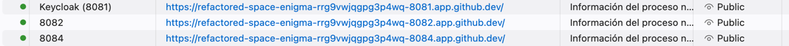

# URL Shortener — Prototype (AI-Assisted Engineering)

## What this is

A URL-shortening service prototype, built as an exercise in **AI-assisted engineering
execution**: the point isn't only the system itself, but demonstrating requirement
comprehension, task decomposition, disciplined AI-driven execution with full traceability, and
conscious risk management under a fixed timebox. The full methodology and technical detail live
in [`ARCHITECTURE.md`](./ARCHITECTURE.md); this document is the executive summary.

## Plan and Rationale

- **Stack:** Java 17 / Spring Boot 3.x, PostgreSQL (source of truth), Redis (redirect cache +
  rate limiting, never counters), RabbitMQ (separate queues for analytics and bulk), Keycloak
  (OIDC).
- **Scope:** full — real OIDC auth, asynchronous bulk creation, custom alias, expiration,
  enriched analytics. The most ambitious level on both axes was chosen deliberately, with an
  explicit cut plan for if time runs short (see below).
- **Deployment:** local Kubernetes (`kind`/`k3d`) inside GitHub Codespaces, with a documented but
  unexecuted path to GKE — engineering time is prioritized over spending the timebox on a real
  cloud provider's credentials and billing.
- **Architecture:** Strangler Fig pattern with a V1 Monolith and V2 Microservices, where V1 is a
  **didactic simulation** of a legacy system (no real legacy exists; it is built minimally on Day
  1 and then treated as legacy from Day 2 onward) — declared explicitly so the exercise is
  defensible to any technical reviewer.
- **Day-by-day plan** (full detail in `ARCHITECTURE.md` §7): Day 1 builds the system from scratch
  as the Greenfield foundation (V1, Gateway, V2 services, infra, CI); Day 2 proves the Brownfield
  story with two concrete scenarios — a standalone V1-only baseline, then the V2 cutover
  alongside it; Day 3 validates the Ambiguous-requirement decisions with executable tests and
  closes with final documentation.
- **Cut priority if time runs short** (explicitly confirmed): protect the three scenarios
  (Greenfield/Brownfield/Ambiguous) above everything else. Cut order: (1) live Kubernetes →
  docker-compose + manifests left unexecuted, (2) full OIDC → simple JWT, (3) asynchronous bulk →
  synchronous bulk.

Full rationale for every decision is in `ARCHITECTURE.md` §3.4 (Key Decisions).

## Artifacts

- [`ARCHITECTURE.md`](./ARCHITECTURE.md) — architecture, the three scenarios, setup, testing,
  security, risks, and the git/PR workflow.
- `README.md` (this document) — executive summary.
- [`.github/PULL_REQUEST_TEMPLATE.md`](./.github/PULL_REQUEST_TEMPLATE.md) — engineer↔AI
  traceability template for every change.
- [`infra/k8s/`](./infra/k8s/) — Kubernetes manifests and the `kind` deployment script (see
  `infra/k8s/README.md`).
- Postman collection covering a Greenfield flow (V2 as the primary system) and a Brownfield
  flow (V1 baseline, then a V2 cutover), including the live reproduction of the Gateway
  routing defect below. Two ways to get the files:
  - View/open in the repo:
    [`docs/url-shortener-enterprise.postman_collection.json`](./docs/url-shortener-enterprise.postman_collection.json) ·
    [`docs/url-shortener-enterprise.postman_environment.json`](./docs/url-shortener-enterprise.postman_environment.json)
  - Direct download (raw file, e.g. for Postman's "Import → Link" or `curl -O`):
    [collection](https://raw.githubusercontent.com/arturomendezarg/urlshortener/main/docs/url-shortener-enterprise.postman_collection.json) ·
    [environment](https://raw.githubusercontent.com/arturomendezarg/urlshortener/main/docs/url-shortener-enterprise.postman_environment.json)

## Risks, Trade-offs, and Validation

The full risks and guardrails are in `ARCHITECTURE.md` §12; the most relevant: silent loss of a
click event if RabbitMQ is down at the moment of publishing (accepted, non-critical, mitigable
later with an outbox pattern), and abuse of the shortener for phishing/open-redirect (mitigated
with scheme/host validation at creation time). Design trade-offs (Monolith+Microservices vs.
building everything at once, Redis cache vs. direct DB access, Keycloak vs. a homegrown
Authorization Server, async vs. synchronous bulk) are detailed in §14, each with its own
justification. Validation rests on unit tests, characterization tests for the brownfield
scenario, and Testcontainers integration tests (real Postgres/Redis/RabbitMQ) — detail in §10.

## Assumptions

Summary (full detail in `ARCHITECTURE.md` §2): prototype-scale traffic (not real production
load); single region; no formal compliance requirements (IP anonymization is a good practice, not
a response to a specific legal obligation); the public link is indistinguishable between V1 and
V2; Codespaces/local Docker is assumed, not a GCP account with active billing.

## Limitations

Summary (full detail in `ARCHITECTURE.md` §13): a few seconds of eventual consistency in
analytics; no persistent storage in the local kind/k3d cluster; no verification against external
phishing/malware lists; no real GKE deployment within this exercise's timebox.

## For reviewers: setup and verification

Full detail in `ARCHITECTURE.md` §9. This section is the condensed path to get the system
running and exercise it yourself, with two setup options. You can drive it with the Postman
collection (see "Artifacts" above) or with the `curl` sequence below — both exercise the
same requests.

### 1. Open the Codespace

The repository is public, so no invitation is needed — anyone with a GitHub account can spin up
their own, isolated Codespace from it:

1. Go to <https://github.com/arturomendezarg/urlshortener>.
2. Click the green **`<> Code`** button → **Codespaces** tab → **Create codespace on main**.

`.devcontainer/setup.sh` preconfigures Java 17, Maven, Docker and `kubectl`/`kind` on creation.
**`k3d` is not preinstalled** — install it once per Codespace if you take option B below:

```bash
curl -s https://raw.githubusercontent.com/k3d-io/k3d/main/install.sh | bash
```

### 2. Run the system — pick one

**Option A — fast dev loop (`docker-compose` + Maven):**

```bash
docker-compose up -d                    # Postgres, Redis, RabbitMQ, Keycloak
mvn clean install -DskipTests           # build all 7 reactor modules once
mvn -pl v1-legacy-monolith spring-boot:run       # :8080, each in its own terminal
mvn -pl api-gateway spring-boot:run              # :8082
mvn -pl analytics-worker spring-boot:run         # :8083
mvn -pl v2-shortener-service spring-boot:run     # :8084
mvn -pl bulk-processor spring-boot:run           # :8085
```

**Option B — the actual Kubernetes deployment (`k3d`), verified end-to-end:**

`./infra/k8s/deploy-to-k3d.sh` takes about **10 minutes** start to finish on a Codespace's
default resources (building and importing all 5 images, then bringing up 9 pods) — it isn't
stuck if it sits quiet for a few minutes on the image-build or image-import step; let it run.

```bash
docker-compose down                     # the two cannot run at once, see infra/k8s/README.md
./infra/k8s/deploy-to-k3d.sh
```

This is the path documented and exercised in `infra/k8s/README.md` — all 9 pods reaching
`Ready`, real OIDC auth, and both the V1 and V2 redirect paths confirmed over HTTP. That
document also has troubleshooting for a suspended Codespace, port conflicts with option A, and
reading a pod that looks stuck but isn't.

Both options expose the same 3 ports (8081 Keycloak, 8082 Gateway, 8084 V2), so the commands
below work unchanged regardless of which one you ran.

### Verify it's ready before running Postman or the `curl` sequence

**Option B (`k3d`):** wait on every pod in the namespace instead of guessing from the elapsed
time — this returns as soon as everything is actually `Ready`, or fails loudly if something
doesn't come up within the timeout instead of leaving you guessing:

```bash
kubectl -n url-shortener wait --for=condition=ready pod --all --timeout=300s
```

Every one of the 9 lines it prints must end in **`condition met`**, for example:

```text
pod/analytics-worker-67654c4958-4wvbq condition met
pod/api-gateway-66966df67f-8wvrd condition met
pod/bulk-processor-68db4bb654-tzlxq condition met
pod/keycloak-689fb5ffdd-c6t4k condition met
pod/postgres-6975f4fd95-nsjxd condition met
pod/rabbitmq-54c8c4fdd8-tdp85 condition met
pod/redis-7555cc6-224w5 condition met
pod/v1-legacy-monolith-6975f8764f-tzmm5 condition met
pod/v2-shortener-service-57969f8845-86pjs condition met
```

If instead a line says `timed out waiting for the condition on pods/<name>`, that pod is not
ready yet — check it with `kubectl -n url-shortener describe pod/<name>` before moving on to
Postman or `curl` (see "Troubleshooting" in `infra/k8s/README.md`).

**Option A (`docker-compose` + Maven):** each of the 5 `mvn spring-boot:run` terminals prints
its own `Started ...Application in N seconds` when ready, but checking all 5 health endpoints
at once is faster than tabbing through terminals:

```bash
for p in 8080 8082 8083 8084 8085; do
  printf '%s -> ' "$p"
  curl -s -o /dev/null -w '%{http_code}\n' "http://localhost:$p/actuator/health"
done
```

All 5 lines should read `200` before moving on.

### Running Postman from your own machine, not inside the Codespace

Everything above assumes `localhost` resolves to the Codespace itself — true if you run
`curl` in its integrated terminal, or Postman's web/VS Code extension inside it. If instead you
run the Postman *desktop* app on your own computer, `localhost` in the environment's URLs
resolves to your machine, not the Codespace, and every request fails with `ECONNREFUSED`. Fix:

Import both files directly into that desktop app first if you haven't already (same links as
"Artifacts" above):
[collection](https://raw.githubusercontent.com/arturomendezarg/urlshortener/main/docs/url-shortener-enterprise.postman_collection.json) ·
[environment](https://raw.githubusercontent.com/arturomendezarg/urlshortener/main/docs/url-shortener-enterprise.postman_environment.json).

1. Open the **PORTS** tab in the Codespace (bottom panel).
2. For each of `8081` (Keycloak), `8082` (Gateway) and `8084` (V2), forward it if it isn't
   listed yet: click **Add Port**, type the port number, Enter.
3. Right-click each of those three rows → **Port Visibility** → **Public**. Leaving them
   `Private` makes GitHub redirect to a browser sign-in page instead of your API response,
   which breaks a non-browser client like Postman.
4. Copy each row's forwarded address (`https://<codespace-name>-<port>.app.github.dev`, no
   trailing slash) and paste it over the matching value in the Postman environment:
   `keycloakUrl` (8081), `gatewayUrl` (8082), `v2Url` (8084).
5. Make sure it is public.



**Do this again every time the Codespace stops and you restart it** (GitHub stops an idle
Codespace automatically, by default after 30 minutes of inactivity — see "Idle timeout" in the
Codespace's settings if you want to raise that). A restart does not resume where it left off:
it deallocates and reboots the VM, so Docker/k3d comes back empty, port forwarding is gone, and
port visibility resets to `Private`. After restarting: redeploy first if you're on Option B
(`./infra/k8s/deploy-to-k3d.sh`, or `docker-compose up -d` again on Option A), *then* repeat
steps 1-4 above — the Codespace's URL itself doesn't change across a restart, so nothing else
in the Postman environment needs touching.

### 3. Exercise it

This is the `curl` equivalent of the Postman collection (see "Artifacts") for a terminal-only
pass — the same sequence run against the live k3d deployment, transcript in
[`infra/k8s/README.md`](./infra/k8s/README.md#smoke-test):

```bash
# Token (the imported realm's demo/demo_local user)
RESP=$(curl -s -X POST http://localhost:8081/realms/urlshortener/protocol/openid-connect/token \
  -H 'Content-Type: application/x-www-form-urlencoded' \
  -d 'grant_type=password&client_id=url-shortener-v2&username=demo&password=demo_local')
TOKEN=$(echo "$RESP" | sed -n 's/.*"access_token"[[:space:]]*:[[:space:]]*"\([^"]*\)".*/\1/p')

# V1: create and redirect, both through the Gateway
V1=$(curl -s -X POST http://localhost:8082/api/v1/urls \
  -H 'Content-Type: application/json' -d '{"longUrl":"https://example.com/soy-v1"}')
V1CODE=$(echo "$V1" | sed -n 's/.*"shortCode"[[:space:]]*:[[:space:]]*"\([^"]*\)".*/\1/p')
curl -i -s "http://localhost:8082/${V1CODE}" | head -1

# V2: create with the real JWT, then follow the redirect
curl -i -s -X POST http://localhost:8084/api/v2/urls \
  -H "Authorization: Bearer ${TOKEN}" -H 'Content-Type: application/json' \
  -d '{"longUrl":"https://example.com/soy-v2","customAlias":"demoV2"}' | head -1
curl -i -s http://localhost:8084/demoV2 | head -1
```

Expect `201` on both creates and a `30x` on both redirects. If you also try `GET
http://localhost:8082/demoV2` (the V2 code, but *through the Gateway*) before the direct read
above, expect `302` immediately -- no prior direct read against V2 required. That used to
reproduce a Gateway routing defect on purpose; it's fixed now, see `ARCHITECTURE.md` §13 and
`infra/k8s/README.md` ("Gateway routing: V1-vs-V2") for what changed.

### 4. Verifying IP anonymization (Scenario C privacy requirement)

The privacy half of Scenario C ("respect privacy" → anonymize the last octet of the client IP
before persisting a click event, see `ARCHITECTURE.md` §6) has no HTTP endpoint to assert
against: `analytics-worker` only consumes from the `click-events` queue and writes to Postgres,
it exposes no REST API of its own. That is also why the Postman collection's
"3. Ambiguous - smart, private links" folder has no request for it — there is nothing for
Postman to call. Verify it directly against the database instead:

1. Trigger at least one redirect first (any request under "1. Greenfield" or "2. Brownfield"
   that hits `/{shortCode}` — a click event is only published on a redirect, not on create).
2. Open a `psql` shell against Postgres:

   ```bash
   # k3d / kind
   kubectl -n url-shortener exec -it deploy/postgres -- psql -U urlshortener -d urlshortener

   # docker-compose
   docker compose exec postgres psql -U urlshortener -d urlshortener
   ```

3. Run:

   ```sql
   SELECT short_code, anonymized_ip, device_type, occurred_at
   FROM click_events
   ORDER BY occurred_at DESC
   LIMIT 5;
   ```

Expect `anonymized_ip` to always end in `.0` for an IPv4 address (e.g. a client IP of
`172.18.0.1` is stored as `172.18.0.0`) — the last octet is zeroed by `IpAnonymizer` before the
row is ever written, so the raw client IP is never persisted at all. See
[`analytics-worker/src/main/java/com/artmendez/urlshortener/analytics/service/IpAnonymizer.java`](./analytics-worker/src/main/java/com/artmendez/urlshortener/analytics/service/IpAnonymizer.java)
for the exact rule (IPv6 zeroes the trailing 80 bits instead).

## Current status

See `ARCHITECTURE.md` §7 for the day-by-day plan and `AI_USAGE_LOG.md` for the complete,
PR-by-PR history.
